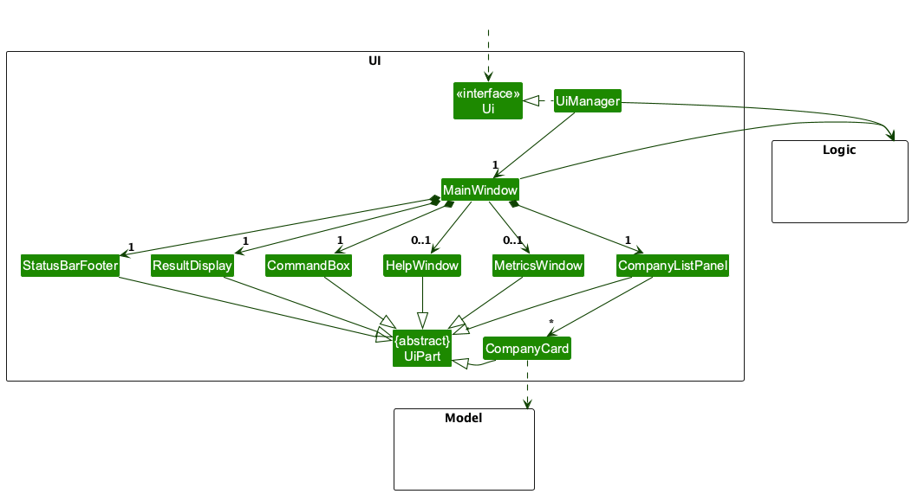
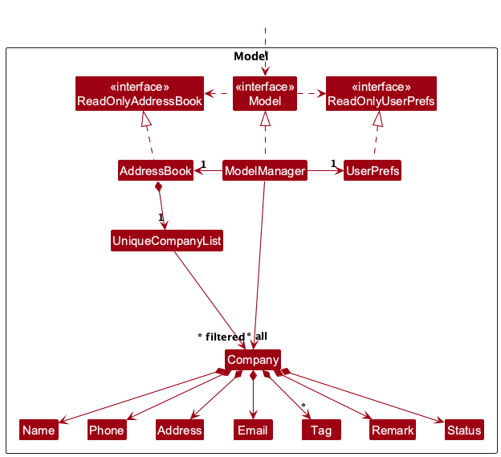
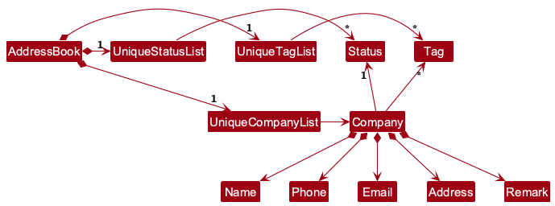

* Table of Contents
{:toc}

--------------------------------------------------------------------------------------------------------------------

## **Acknowledgements**

* {list here sources of all reused/adapted ideas, code, documentation, and third-party libraries -- include links to the original source as well}
* I, Bridget, used Claude Code to fix Checkstyle errors and improve code formatting across the codebase. All suggestions were reviewed before being applied.
* I, Jeffrey, used Claude to prettify the Release Notes into a markdown format.

--------------------------------------------------------------------------------------------------------------------

## **Setting up, getting started**

Refer to the guide [_Setting up and getting started_](SettingUp.md).

--------------------------------------------------------------------------------------------------------------------

## **Design**

:bulb: **Tip:** The `.puml` files used to create diagrams are in this document `docs/diagrams` folder. Refer to the [_PlantUML Tutorial_ at se-edu/guides](https://se-education.org/guides/tutorials/plantUml.html) to learn how to create and edit diagrams.

### Architecture

The ***Architecture Diagram*** given above explains the high-level design of the App.

Given below is a quick overview of main components and how they interact with each other.

**Main components of the architecture**

**`Main`** (consisting of classes [`Main`](https://github.com/AY2526S1-CS2103T-F08a-1/tp/tree/master/src/main/java/seedu/address/Main.java) and [`MainApp`](https://github.com/AY2526S1-CS2103T-F08a-1/tp/tree/master/src/main/java/seedu/address/MainApp.java)) is in charge of the app launch and shut down.
* At app launch, it initializes the other components in the correct sequence, and connects them up with each other.
* At shut down, it shuts down the other components and invokes cleanup methods where necessary.

The bulk of the app's work is done by the following four components:

* [**`UI`**](#ui-component): The UI of the App.
* [**`Logic`**](#logic-component): The command executor.
* [**`Model`**](#model-component): Holds the data of the App in memory.
* [**`Storage`**](#storage-component): Reads data from, and writes data to, the hard disk.

[**`Commons`**](#common-classes) represents a collection of classes used by multiple other components.

**How the architecture components interact with each other**

The *Sequence Diagram* below shows how the components interact with each other for the scenario where the user issues the command `delete 1`.

Each of the four main components (also shown in the diagram above),

* defines its *API* in an `interface` with the same name as the Component.
* implements its functionality using a concrete `{Component Name}Manager` class (which follows the corresponding API `interface` mentioned in the previous point.

For example, the `Logic` component defines its API in the `Logic.java` interface and implements its functionality using the `LogicManager.java` class which follows the `Logic` interface. Other components interact with a given component through its interface rather than the concrete class (reason: to prevent outside component's being coupled to the implementation of a component), as illustrated in the (partial) class diagram below.

The sections below give more details of each component.

### UI component

The **API** of this component is specified in [`Ui.java`](https://github.com/AY2526S1-CS2103T-F08a-1/tp/tree/master/src/main/java/seedu/address/ui/Ui.java)

The UI consists of a `MainWindow` that is made up of parts e.g.`CommandBox`, `ResultDisplay`, `CompanyListPanel`, `StatusBarFooter` etc. All these, including the `MainWindow`, inherit from the abstract `UiPart` class which captures the commonalities between classes that represent parts of the visible GUI.

Additionally, the UI includes separate window components:
* `HelpWindow` - Displays help information to the user
* `MetricsWindow` - Displays statistics and metrics about the companies in the address book
* `ClosableWindow` - Abstract base class for windows that can be closed with keyboard shortcuts

The `UI` component uses the JavaFx UI framework. The layout of these UI parts are defined in matching `.fxml` files that are in the `src/main/resources/view` folder. For example, the layout of the [`MainWindow`](https://github.com/AY2526S1-CS2103T-F08a-1/tp/tree/master/src/main/java/seedu/address/ui/MainWindow.java) is specified in [`MainWindow.fxml`](https://github.com/AY2526S1-CS2103T-F08a-1/tp/tree/master/src/main/resources/view/MainWindow.fxml)

The `UI` component,

* executes user commands using the `Logic` component.
* listens for changes to `Model` data so that the UI can be updated with the modified data.
* keeps a reference to the `Logic` component, because the `UI` relies on the `Logic` to execute commands.
* depends on some classes in the `Model` component, as it displays `Company` object residing in the `Model`.

### Logic component

**API** : [`Logic.java`](https://github.com/AY2526S1-CS2103T-F08a-1/tp/tree/master/src/main/java/seedu/address/logic/Logic.java)

Here's a (partial) class diagram of the `Logic` component:

The sequence diagram below illustrates the interactions within the `Logic` component, taking `execute("delete 1")` API call as an example.

:information_source: **Note:** The lifeline for `DeleteCommandParser` should end at the destroy marker (X) but due to a limitation of PlantUML, the lifeline continues till the end of diagram.

How the `Logic` component works:

1. When `Logic` is called upon to execute a command, it is passed to an `AddressBookParser` object which in turn creates a parser that matches the command (e.g., `DeleteCommandParser`) and uses it to parse the command.
1. This results in a `Command` object (more precisely, an object of one of its subclasses e.g., `DeleteCommand`) which is executed by the `LogicManager`.
1. The command can communicate with the `Model` when it is executed (e.g. to delete a company). 
   Note that although this is shown as a single step in the diagram above (for simplicity), in the code it can take several interactions (between the command object and the `Model`) to achieve.
1. The result of the command execution is encapsulated as a `CommandResult` object which is returned back from `Logic`.

Here are the other classes in `Logic` (omitted from the class diagram above) that are used for parsing a user command:

How the parsing works:
* When called upon to parse a user command, the `AddressBookParser` class creates an `XYZCommandParser` (`XYZ` is a placeholder for the specific command name e.g., `AddCommandParser`) which uses the other classes shown above to parse the user command and create a `XYZCommand` object (e.g., `AddCommand`) which the `AddressBookParser` returns back as a `Command` object.
* All `XYZCommandParser` classes (e.g., `AddCommandParser`, `DeleteCommandParser`, ...) inherit from the `Parser` interface so that they can be treated similarly where possible e.g, during testing.

The following commands are currently supported:
* `AddCommand` - Adds a company to the address book
* `EditCommand` - Edits an existing company's details
* `DeleteCommand` - Deletes a company from the address book
* `FindCommand` - Finds companies by name keywords
* `FilterCommand` - Filters companies by status
* `ListCommand` - Lists all companies
* `ClearCommand` - Clears all companies from the address book
* `MetricsCommand` - Displays statistics about the companies
* `HelpCommand` - Shows help information
* `ExitCommand` - Exits the application

### Model component
**API** : [`Model.java`](https://github.com/AY2526S1-CS2103T-F08a-1/tp/tree/master/src/main/java/seedu/address/model/Model.java)

The `Model` component,

* stores the address book data i.e., all `Company` objects (which are contained in a `UniqueCompanyList` object).
* stores the currently 'selected' `Company` objects (e.g., results of a search query) as a separate _filtered_ list which is exposed to outsiders as an unmodifiable `ObservableList<Company>` that can be 'observed' e.g. the UI can be bound to this list so that the UI automatically updates when the data in the list change.
* stores a `UserPref` object that represents the user's preferences. This is exposed to the outside as a `ReadOnlyUserPref` objects.
* does not depend on any of the other three components (as the `Model` represents data entities of the domain, they should make sense on their own without depending on other components)

Each `Company` object contains the following fields:
* `Name` (required) - The company name
* `Phone` (optional/nullable) - Contact phone number
* `Email` (optional/nullable) - Contact email address
* `Address` (optional/nullable) - Company address
* `Tags` (required, but can be empty) - Set of tags for categorization
* `Remark` (required, but can be empty) - Additional notes about the company
* `Status` (required) - Application status (e.g., Applied, Interview, Offered, Rejected)

#### Design considerations for nullable fields

**Aspect: How optional fields (Phone, Email, Address, Remark) are represented:**

The current implementation uses wrapper objects (e.g., `Phone`, `Email`, `Address`, `Remark`) that can hold null values internally, but the `Company` object never stores null references to these wrapper objects.

**Key design principles:**
* All fields passed to the `Company` constructor must be non-null (enforced by `requireAllNonNull`)
* Empty/absent values are represented by wrapper objects containing null internally (e.g., `new Phone(null)`)
* The `Company` object always has non-null references to all wrapper objects, even if the values inside are null

**Rationale:**

This design is crucial for commands like `EditCommand` to function correctly. In `EditCommand.EditCompanyDescriptor`, null is used to represent "do not edit this field", while a wrapper object with null inside (e.g., `new Phone(null)`) represents "clear this field to empty".

For example:
* `editCompanyDescriptor.getPhone()` returns `Optional.empty()` → means "don't change the phone number"
* `editCompanyDescriptor.getPhone()` returns `Optional.of(new Phone(null))` → means "clear the phone number"

If `Company` stored null directly in its fields, `EditCommand` would be unable to distinguish between "unedited field" and "cleared field", as both would be represented as null.

:information_source: **Note:** An alternative approach would be to store null directly in `Company` fields, which is simpler but makes it impossible for `EditCommand` to distinguish between fields that should remain unchanged versus fields that should be cleared.

:information_source: **Note:** An alternative (arguably, a more OOP) model is given below. It has a `Tag` list in the `AddressBook`, which `Company` references. This allows `AddressBook` to only require one `Tag` object per unique tag, instead of each `Company` needing their own `Tag` objects. Similarly, `Status` objects are stored centrally, but each `Company` can reference at most one `Status`.  

### Storage component

**API** : [`Storage.java`](https://github.com/AY2526S1-CS2103T-F08a-1/tp/tree/master/src/main/java/seedu/address/storage/Storage.java)

The `Storage` component,
* can save both address book data and user preference data in JSON format, and read them back into corresponding objects.
* inherits from both `AddressBookStorage` and `UserPrefStorage`, which means it can be treated as either one (if only the functionality of only one is needed).
* depends on some classes in the `Model` component (because the `Storage` component's job is to save/retrieve objects that belong to the `Model`)

### Common classes

Classes used by multiple components are in the `seedu.address.commons` package.

--------------------------------------------------------------------------------------------------------------------

## **Implementation**

This section describes some noteworthy details on how certain features are implemented.

### Filter feature

The filter feature allows users to filter companies by their application status. This is implemented through the `FilterCommand` class.

#### Implementation

The `FilterCommand` works as follows:

1. The user executes `filter s/STATUS` (e.g., `filter s/in-process`)
2. The `FilterCommandParser` parses the status parameter and creates a `FilterCommand` object
3. The `FilterCommand` updates the filtered company list in the model using a predicate that matches companies with the specified status
4. The UI automatically updates to display only companies matching the filter

The supported status values are:
* `to-apply` - Companies the user plans to apply to
* `applied` - Applications that have been submitted
* `oa` - Online assessment stage
* `tech-interview` - Technical interview stage
* `hr-interview` - HR interview stage
* `in-process` - Applications currently in process
* `offered` - Received an offer
* `accepted` - Accepted an offer
* `rejected` - Application rejected

#### Design considerations

**Aspect: How to implement filtering:**

* **Alternative 1 (current choice):** Use a predicate to filter the ObservableList
  * Pros: Simple to implement, leverages existing filtered list functionality
  * Cons: Limited to single status filtering at a time

* **Alternative 2:** Allow multiple status filters
  * Pros: More flexible for users who want to see multiple statuses
  * Cons: More complex parsing and predicate logic required

### Metrics feature

The metrics feature provides users with statistics about their internship applications. This is implemented through the `MetricsCommand` and `MetricsWindow` classes.

#### Implementation

The `MetricsCommand` works as follows:

1. The user executes the `metrics` command
2. The `MetricsCommand` returns a `CommandResult` with `showMetrics` flag set to true
3. The `MainWindow` detects this flag and opens/focuses the `MetricsWindow`
4. The `MetricsWindow` retrieves data from the address book and displays statistics about application statuses

The metrics window shows:
* Distribution of applications across different status categories
* Total number of applications
* Visual representation of application progress

### \[Proposed\] Undo/redo feature

#### Proposed Implementation

The proposed undo/redo mechanism is facilitated by `VersionedAddressBook`. It extends `AddressBook` with an undo/redo history, stored internally as an `addressBookStateList` and `currentStatePointer`. Additionally, it implements the following operations:

* `VersionedAddressBook#commit()` — Saves the current address book state in its history.
* `VersionedAddressBook#undo()` — Restores the previous address book state from its history.
* `VersionedAddressBook#redo()` — Restores a previously undone address book state from its history.

These operations are exposed in the `Model` interface as `Model#commitAddressBook()`, `Model#undoAddressBook()` and `Model#redoAddressBook()` respectively.

Given below is an example usage scenario and how the undo/redo mechanism behaves at each step.

Step 1. The user launches the application for the first time. The `VersionedAddressBook` will be initialized with the initial address book state, and the `currentStatePointer` pointing to that single address book state.

Step 2. The user executes `delete 5` command to delete the 5th company in the address book. The `delete` command calls `Model#commitAddressBook()`, causing the modified state of the address book after the `delete 5` command executes to be saved in the `addressBookStateList`, and the `currentStatePointer` is shifted to the newly inserted address book state.

Step 3. The user executes `add n/David …​` to add a new company. The `add` command also calls `Model#commitAddressBook()`, causing another modified address book state to be saved into the `addressBookStateList`.

:information_source: **Note:** If a command fails its execution, it will not call `Model#commitAddressBook()`, so the address book state will not be saved into the `addressBookStateList`.

Step 4. The user now decides that adding the company was a mistake, and decides to undo that action by executing the `undo` command. The `undo` command will call `Model#undoAddressBook()`, which will shift the `currentStatePointer` once to the left, pointing it to the previous address book state, and restores the address book to that state.

:information_source: **Note:** If the `currentStatePointer` is at index 0, pointing to the initial AddressBook state, then there are no previous AddressBook states to restore. The `undo` command uses `Model#canUndoAddressBook()` to check if this is the case. If so, it will return an error to the user rather
than attempting to perform the undo.

The following sequence diagram shows how an undo operation goes through the `Logic` component:

:information_source: **Note:** The lifeline for `UndoCommand` should end at the destroy marker (X) but due to a limitation of PlantUML, the lifeline reaches the end of diagram.

Similarly, how an undo operation goes through the `Model` component is shown below:

The `redo` command does the opposite — it calls `Model#redoAddressBook()`, which shifts the `currentStatePointer` once to the right, pointing to the previously undone state, and restores the address book to that state.

:information_source: **Note:** If the `currentStatePointer` is at index `addressBookStateList.size() - 1`, pointing to the latest address book state, then there are no undone AddressBook states to restore. The `redo` command uses `Model#canRedoAddressBook()` to check if this is the case. If so, it will return an error to the user rather than attempting to perform the redo.

Step 5. The user then decides to execute the command `list`. Commands that do not modify the address book, such as `list`, will usually not call `Model#commitAddressBook()`, `Model#undoAddressBook()` or `Model#redoAddressBook()`. Thus, the `addressBookStateList` remains unchanged.

Step 6. The user executes `clear`, which calls `Model#commitAddressBook()`. Since the `currentStatePointer` is not pointing at the end of the `addressBookStateList`, all address book states after the `currentStatePointer` will be purged. Reason: It no longer makes sense to redo the `add n/David …​` command. This is the behavior that most modern desktop applications follow.

The following activity diagram summarizes what happens when a user executes a new command:

#### Design considerations:

**Aspect: How undo & redo executes:**

* **Alternative 1 (current choice):** Saves the entire address book.
  * Pros: Easy to implement.
  * Cons: May have performance issues in terms of memory usage.

* **Alternative 2:** Individual command knows how to undo/redo by
  itself.
  * Pros: Will use less memory (e.g. for `delete`, just save the company being deleted).
  * Cons: We must ensure that the implementation of each individual command are correct.

_{more aspects and alternatives to be added}_

### \[Proposed\] Data archiving

_{Explain here how the data archiving feature will be implemented}_

--------------------------------------------------------------------------------------------------------------------

## **Documentation, logging, testing, configuration, dev-ops**

* [Documentation guide](Documentation.md)
* [Testing guide](Testing.md)
* [Logging guide](Logging.md)
* [Configuration guide](Configuration.md)
* [DevOps guide](DevOps.md)

--------------------------------------------------------------------------------------------------------------------

## **Appendix: Requirements**

### Product scope

**Target user profile**:

* Computer Science students mass applying for internships
* Well-accustomed to CLI-interfaces and prefers keyboard shortcuts over GUI interfaces
* Fast typist who prefers typing to mouse interactions
* Makes occasional data entry mistakes
* Needs to manage a significant number of internship applications simultaneously
* Is reasonably comfortable using CLI apps

**Value proposition**: Helps students keep track of prospective and current internship companies and their application status in a centralized location. Manages applications faster than a typical mouse/GUI driven app.

### User stories

Priorities: High (must have) - `* * *`, Medium (nice to have) - `* *`, Low (unlikely to have) - `*`

| Priority | As a …​                                    | I want to …​                     | So that I can…​                                                        |
| -------- | ------------------------------------------ | ------------------------------ | ---------------------------------------------------------------------- |
| `* * *`  | first-time applicant                       | track potential companies I might apply for in the future | apply for them after I have made substantial progress |
| `* * *`  | applicant who loves structure and organisation | add my interested companies | store and organize my internship applications |
| `* * *`  | user who dislikes clutter                  | delete an existing internship application | remove outdated or unnecessary entries from my tracker |
| `* *`    | mass internship applicant                  | record the OA questions that I have done before | revise them for future interviews |
| `* *`    | overzealous student applying to a ridiculous number of companies | assign scores to each aspect of a company | compare the companies based on my preferences |
| `* *`    | person who holds regard in contacting HR   | store HR contact details in the tracker | reach out to them easily |
| `* *`    | student that is able to land multiple internships | sort the companies by pay | renegotiate my salaries and make decisions between offers more easily |
| `* *`    | person who is concerned with work life balance | sort the companies by internship benefits | maximize my work life balance when deciding on an internship |
| `* *`    | busy applicant                             | sort my internship applications by the stages | keep track of where I am in each process |
| `* *`    | prospective user                           | differentiate between applications that have referral and those who don't | prioritize the applications that I want to focus on |
| `* *`    | intern with specific work preferences      | sort by the mode of work that I most prefer | prioritize the interns with the type of work arrangement that I prefer |
| `* *`    | person who wants to save time              | sort by travel duration | prioritize those that are closer to me |
| `* *`    | applicant applying for different roles     | have easy access to different versions of my resume | apply to different role openings quickly without needing to edit my resume regularly |
| `* *`    | user who often forgets deadlines           | set reminders for application deadlines | not miss important application deadlines |
| `* *`    | user who often forgets deadlines           | set reminders for OA deadlines | not miss important OA deadlines |
| `* *`    | user who often forgets deadlines           | set reminders for interview deadlines | never miss important interview deadlines |
| `*`      | user who prefers keyboard shortcuts over mouse clicks | always be typing while minimizing having to switch to my mouse/trackpad | save time and work efficiently |
| `*`      | organised person                           | filter applications by status (Applied, Interviewing, Offer, Rejected) | focus on pending or priority applications |
| `*`      | forgetful person                           | see my notes that I took about each company | prepare for my interviews |
| `*`      | busy student with packed schedules         | see which internship periods will clash with my school term | take note of them and decide accordingly if I can afford the clash |
| `*`      | busy applicant                             | track my current open applications that I might have left halfway | get back to my open applications that I have done halfway |
| `*`      | forgetful Computer Science student         | sort my internship applications by the next deadline | remember what interview or assessment to prepare for next |
| `*`      | user who makes frequent careless mistakes  | update the details of an existing company | keep the information accurate and up-to-date |
| `*`      | user                                       | view all companies at once | see the overall status of my applications |
| `*`      | impatient user                             | search applications by name, company, role, or application status | quickly locate a specific application without scrolling through the entire list |
| `*`      | student that loves to be organised         | sort applications alphabetically or by other fields (dates, ranking) | browse applications more efficiently |
| `*`      | error-prone person                         | undo or redo my recent changes | correct mistakes easily |
| `*`      | careless student                           | detect potential duplicate applications | keep my application book clean and not resubmit applications |
| `*`      | user who may not always have all the necessary information ready at once | create a partial entry with whatever details I have at the moment | fill in the rest later when I acquire it |

### Use cases

(For all use cases below, the **System** is the `Cerebro` and the **Actor** is the `user`, unless specified otherwise)

**Use case: UC01 - Delete a company**

**MSS**

1.  User requests to list companies
2.  Cerebro shows a list of companies
3.  User requests to delete a specific company in the list
4.  Cerebro deletes the company

    Use case ends.

**Extensions**

* 2a. The list is empty.

  * 2a1. Cerebro shows a message indicating no companies to delete.

    Use case ends.

* 3a. The given index is invalid (non-numeric, zero, negative, or out of range).

  * 3a1. Cerebro shows an error message.

    Use case resumes at step 2.

* 3b. The index is missing.

  * 3b1. Cerebro shows the correct command format.

    Use case resumes at step 2.

* 3c. Multiple indices are provided.

  * 3c1. Cerebro carries out deletion of multiple companies.
  * 3c2. Cerebro shows success message for the deletion of multiple companies.

    Use case ends.

---

**Use case: UC02 - List all companies**

**MSS**

1. User requests to view all companies
2. Cerebro displays a numbered list of all companies with their application status and key details

    Use case ends.

**Extensions**

* 2a. The list is empty.

  * 2a1. Cerebro shows a message indicating no companies have been added yet.
  * 2a2. Cerebro suggests using the add command to get started.

    Use case ends.

* 1a. Extra parameters are provided with the list command.

  * 1a1. Cerebro shows an error message with the correct command format.

### Non-Functional Requirements

#### Performance
* The system shall respond to any command operation within 3 seconds when managing up to 100 internship applications.
* A user with above average typing speed for regular English text (i.e. not code, not system admin commands) should be able to accomplish most of the tasks faster using commands than using the GUI.
* The system shall launch within 3 seconds on standard hardware.

#### Reliability & Availability
* Should work on any _mainstream OS_ as long as it has Java '17' or above installed
* The app shall operate offline with full feature availability.
* Data consistency shall be maintained at all times across features (name, phone, email, address, tags, remarks, status).

#### Security & Privacy
* User data must only be stored locally and accessible through the host OS file system — no external server transmission.
* No unintended data exposure between multiple OS user accounts.

#### Scalability & Capacity
* The system shall support at least 100 application entries without significant degradation of performance.
* Find, filter and list operations shall scale linearly with data size up to this limit.

#### Usability & Accessibility
* New users shall be able to complete core tasks (add, list, find) after < 10 minutes of onboarding using the User Guide.
* The interface shall support CLI-first workflow, and screen reader compatibility.

### Glossary

* **Mainstream OS**: Windows, Linux, Unix, MacOS
* **CLI-first interface**: an interface that prioritises keyboard-only interactions in order to optimise for speed of usage
* **Company**: Any entity, legally registered or otherwise, that the user can undertake an internship at; a company can have any number of applications
* **Application**: The entire process of securing a potential internship with the company, starting from the first contact with the company (via email or otherwise) to the point of securing the internship

--------------------------------------------------------------------------------------------------------------------

## **Appendix: Instructions for manual testing**

Given below are instructions to test the app manually.

:information_source: **Note:** These instructions only provide a starting point for testers to work on;
testers are expected to do more *exploratory* testing.

### Launch and shutdown

1. Initial launch

   1. Download the jar file and copy into an empty folder

   1. Double-click the jar file Expected: Shows the GUI with a set of sample companies. The window size may not be optimum.

1. Saving window preferences

   1. Resize the window to an optimum size. Move the window to a different location. Close the window.

   1. Re-launch the app by double-clicking the jar file. 
       Expected: The most recent window size and location is retained.

1. _{ more test cases …​ }_

### Deleting a company

1. Deleting a company while all companies are being shown

   1. Prerequisites: List all companies using the `list` command. Multiple companies in the list.

   1. Test case: `delete 1` 
      Expected: First company is deleted from the list. Details of the deleted company shown in the status message. Timestamp in the status bar is updated.

   1. Test case: `delete 0` 
      Expected: No company is deleted. Error details shown in the status message. Status bar remains the same.

   1. Other incorrect delete commands to try: `delete`, `delete x`, `...` (where x is larger than the list size) 
      Expected: Similar to previous.

1. _{ more test cases …​ }_

### Filtering companies by status

1. Filtering companies by application status

   1. Prerequisites: Have companies with various statuses in the list. Use `list` to see all companies.

   1. Test case: `filter s/applied` 
      Expected: Only companies with status "applied" are shown. Number of companies displayed shown in the status message.

   1. Test case: `filter s/in-process` 
      Expected: Only companies with status "in-process" are shown.

   1. Test case: `filter s/invalid-status` 
      Expected: Error message shown indicating invalid status. List remains unchanged.

   1. Test case: `filter` (missing status parameter) 
      Expected: Error message showing correct command format.

### Viewing metrics

1. Opening the metrics window

   1. Test case: `metrics` 
      Expected: Metrics window opens showing statistics about application statuses. If window is already open, it is brought to focus and data is refreshed.

   1. Test case: Close the metrics window and run `metrics` again 
      Expected: Metrics window reopens with current data.

### Saving data

1. Dealing with missing/corrupted data files

   1. _{explain how to simulate a missing/corrupted file, and the expected behavior}_

1. _{ more test cases …​ }_
