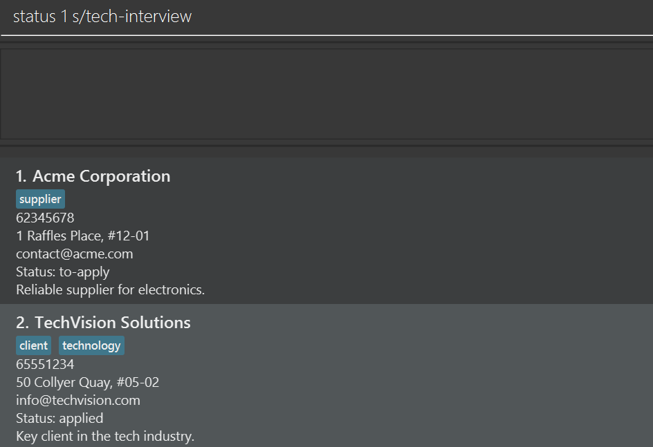
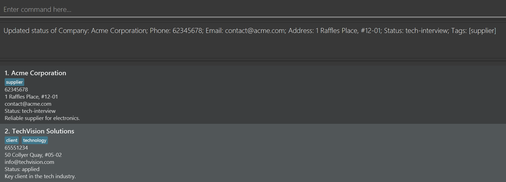
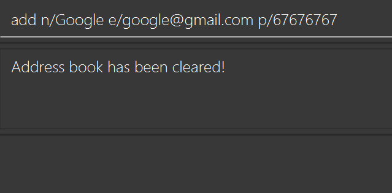
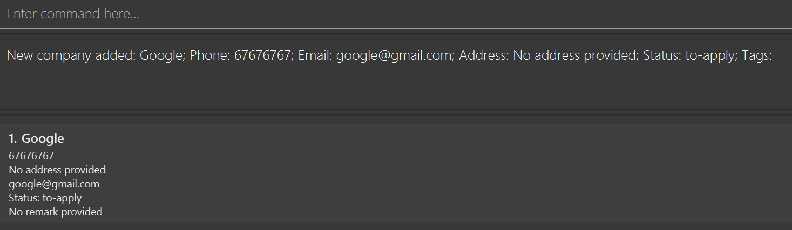
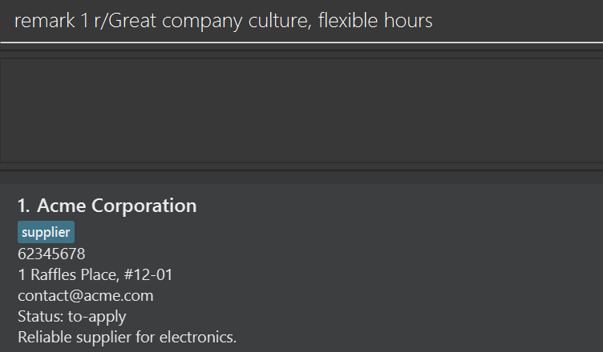

# Cerebro Release Notes

## Overview

Cerebro is a specialized desktop application for CS students to track internship applications, built upon the foundation of AddressBook Level 3 (AB3). While maintaining AB3's CLI-first approach optimized for fast typists, Cerebro has been completely reimagined to address the specific needs of managing internship application pipelines.

---

## Purpose Transformation

**From:** General-purpose contact management for any users
**To:** Specialized internship application tracking for CS students

This fundamental shift drives all feature changes and enhancements detailed below.

---

## Major New Features

### 1. **Application Status Tracking System**
A comprehensive status management system to track your entire internship application journey:

- **New `status` Command:** Quick-update application status with `status INDEX s/STATUS`
- **9 Predefined Status Values (Case insensitive):**
    - `to-apply` - Not yet applied (default)
    - `applied` - Application submitted
    - `oa` - Online Assessment stage
    - `tech-interview` - Technical interview
    - `hr-interview` - HR/behavioral interview
    - `in-process` - General process stage
    - `offered` - Internship offer received
    - `accepted` - Offer accepted
    - `rejected` - Application rejected
- **Visual Pipeline Tracking:** See your entire application pipeline at a glance
- **Status Integration:** Status field integrated into `add` and `edit` commands

**Examples:**
```
status 1 s/tech-interview
status 3 s/offered
add n/Google s/applied
```
<table>
  <tr>
    <td></td>
    <td></td>
  </tr>
</table>

### 2. **Flexible Company Entry System**
Companies can now be added with minimal information and expanded later:

- **Name-Only Entry:** `add n/Google Inc` creates entry with just company name
- **Optional Fields:** All fields except name are now optional
- **Smart Defaults:** Placeholder values auto-filled for omitted fields
- **Incremental Updates:** Add basic info quickly, fill details later with `edit`

**Comparison:**
- **AB3:** Required name, phone, email, and address for every contact
- **Cerebro:** Only company name required; build your entry incrementally, can still add all at once if you'd like

<table>
  <tr>
    <td></td>
    <td></td>
  </tr>
</table>

### 3. **New Remark System**
A dedicated command for managing application notes:

- **New `remark` Command:** `remark INDEX r/[REMARK]`
- **Add/Edit/Delete:** Full CRUD operations for remarks
- **Use Cases:** Track referrals, company culture notes, application tips, deadlines
- **Empty Remark Deletion:** Use `remark INDEX r/` to remove remarks

**Examples:**
```
remark 1 r/Great company culture, flexible hours
remark 2 r/Referral from John Doe
remark 3 r/
```
<table>
  <tr>
    <td></td>
    <td></td>
  </tr>
</table>

### 4. **Application Status Filtering**
Quickly view companies at specific stages of your application pipeline:

- **New `filter` Command:** Filter by status with `filter s/STATUS`
- **Status-Specific Views:** Display only companies matching a particular application stage
- **Pipeline Focus:** Concentrate on applications needing attention (e.g., view all `oa` or `tech-interview` entries)
- **Complements Status Tracking:** Works seamlessly with the status system to provide targeted views
- **Return to Full List:** Use `list` command to restore complete view

**Examples:**
```
filter s/tech-interview
filter s/offered
filter s/in-process
```

### 5. **Batch Operations**
Powerful bulk editing and deletion capabilities for efficient management:

#### **Batch Edit**
- **Comma-Separated:** `edit 1,3,5 s/rejected`
- **Range Edit:** `edit 2-4 s/applied t/tech`
- **Hybrid:** `edit 1,3-5 s/applied`
- **Batch Fields:** Status, tags, and remarks can be edited in bulk
- **Use Case:** Update multiple applications that moved to the same stage

#### **Batch Delete**
- **Comma-Separated:** `delete 1,3,5`
- **Range Delete:** `delete 2-4`
- **Hybrid:** `delete 1,3-5 s/applied`
- **Duplicate Handling:** Duplicate indices automatically ignored

**Comparison:**
- **AB3:** Single-entry edit and delete only
- **Cerebro:** Multi-entry operations with comma and range syntax

---

## Enhanced Existing Features

### **Add Command Improvements**

| Aspect | AB3 | Cerebro |
|--------|-----|---------|
| **Required Fields** | Name, Phone, Email, Address | Name only |
| **Optional Fields** | Tags only | Phone, Email, Address, Remark, Status, Tags |
| **Default Status** | N/A | `to-apply` |
| **Flexibility** | All-or-nothing data entry | Incremental data building |

**New Examples:**
```
add n/Google Inc
add n/Meta p/65432100 e/careers@meta.com
add n/Apple r/Great benefits s/applied
```

### **Edit Command Enhancements**

**New Capabilities:**
- Batch editing with:
  - comma-separated indices
  - `START-END` syntax
  - or BOTH
- Status field editing
- Remark field editing
- Batch operations limited to tags, status, and remarks for data integrity

**Extended Examples:**
```
edit 1,3,5 s/rejected
edit 2-4 s/applied t/tech
edit 2 n/Meta Platforms s/offered t/
```

### **Delete Command Upgrades**

**New Features:**
- Batch delete with:
  - comma-separated indices
  - `START-END` syntax
  - or BOTH
- Automatic duplicate index handling
- Single atomic operation for all deletions

**Comparison:**
- **AB3:** `delete INDEX` (single entry only)
- **Cerebro:** `delete INDEX`, `delete 1,3,5`, `delete 2-4`

---

## Terminology & Context Changes

### Entity Renaming

| AB3 Term | Cerebro Term | Rationale |
|----------|--------------|-----------|
| Person | Company | Tracking companies, not individuals |
| Contact | Company Entry | Entries represent companies with application details |
| Address Book | Cerebro | Application-specific branding |

### Field Purpose Evolution

| Field | AB3 Purpose | Cerebro Purpose |
|-------|-------------|-----------------|
| **Name** | Person's name | Company name |
| **Phone** | Personal phone | Company recruitment line |
| **Email** | Personal email | Company careers/recruitment email |
| **Address** | Home address | Company office location |
| **Tags** | Personal categories | Company attributes (tech, remote-friendly, etc.) |
| **Status** | N/A | Application stage tracking |
| **Remark** | N/A | Application notes and observations |

---

## User Experience Improvements

### **Simplified Quick Start**
- Streamlined example commands focused on internship tracking workflow
- Progressive complexity in examples (minimal → complete entries)

### **Enhanced Documentation**

**New Sections:**
- Detailed status value reference with descriptions
- Batch operation examples and use cases
- FAQ entries specific to internship tracking
- Tips for tracking multiple positions at same company
- Command comparison table (status vs. edit for status updates)

**Improved Sections:**
- Clearer field requirement specifications
- More comprehensive examples for each command
- Better visual formatting with tips and cautions
- Expanded command summary with all variations

### **Developer-Friendly Features**
- Case-insensitive status values (e.g., `APPLIED` = `applied`)
- Flexible parameter ordering maintained
- Duplicate company name prevention (case-insensitive)
- Data file location explicitly documented

---

## Technical Enhancements

### **Data Validation**
- **Unique Company Names:** Case-insensitive duplicate prevention
- **Status Validation:** Only predefined status values accepted
- **Optional Field Handling:** Smart placeholder system for missing data
- **Batch Operation Validation:** Range and index validation with error handling

### **Data Structure**
- **New Fields:** Status and Remark fields added to data model
- **Optional Fields:** Phone, Email, Address now optional in JSON
- **Default Values:** Placeholder values for optional fields in storage
- **Backward Compatibility:** Data file format evolved from AB3 structure

### **Command Processing**
- **Status Command Parser:** New dedicated parser for status updates
- **Remark Command Parser:** New parser for remark operations
- **Batch Index Parser:** Support for comma-separated and range indices
- **Enhanced Edit Parser:** Extended to handle batch operations and new fields

---

## Command Reference Evolution

### New Commands

| Command | Format | Purpose |
|---------|--------|---------|
| **status** | `status INDEX s/STATUS` | Quick status updates |
| **remark** | `remark INDEX r/[REMARK]` | Manage application notes |
| **filter** | `filter s/STATUS` | Filter companies by application status |

### Enhanced Commands

| Command | AB3 Format | Cerebro Format | New Features |
|---------|-----------|----------------|--------------|
| **add** | `add n/NAME p/PHONE e/EMAIL a/ADDRESS [t/TAG]…` | `add n/NAME [p/PHONE] [e/EMAIL] [a/ADDRESS] [r/REMARK] [s/STATUS] [t/TAG]…` | Optional fields, status, remark |
| **edit** | `edit INDEX [fields]…` | `edit INDEX/INDICES/RANGE [fields]…` | Batch edit, range edit, status, remark |
| **delete** | `delete INDEX` | `delete INDEX/INDICES/RANGE` | Batch delete, range delete |

### Unchanged Commands
- `list` - Same functionality, different context
- `find` - Same search behavior, searches company names
- `clear` - Same functionality with updated warnings
- `help` - Same functionality
- `exit` - Same functionality

---

## New FAQ Entries

**Q: What happens if I add a company with the same name as an existing one?**
A: Company names must be unique (case-insensitive). Cerebro will reject duplicates with an error message.

**Q: Can I undo a delete or clear operation?**
A: No, these operations are permanent. Restore from your `Cerebro.json` backup if needed.

**Q: What's the difference between `status` and `edit` for updating status?**
A: `status` is a quick single-purpose command, while `edit` allows multi-field updates. Use whichever is convenient!

---

## Maintained Known Issues

The following known issues from AB3 remain in Cerebro:

1. **Multi-screen GUI positioning** - GUI may open off-screen after switching from secondary to primary screen
    - **Remedy:** Delete `preferences.json` before restarting

2. **Help Window minimization** - Minimized help window doesn't reopen on subsequent `help` commands
    - **Remedy:** Manually restore the minimized window

---

## Future Enhancements (v2.0)

**Planned Features:**
- Data archiving functionality (Undo your delete/clear commands)
- Advanced filtering by status, tags, or date ranges
- Improved search by not requiring exact word match

---

## Feature Comparison Summary

| Category | AB3 | Cerebro |
|----------|-----|---------|
| **Domain** | General contacts | CS internship applications |
| **Required Fields** | 4 (Name, Phone, Email, Address) | 1 (Name only) |
| **Status Tracking** | ❌ | ✅ 9 status values |
| **Remarks/Notes** | ❌ | ✅ Dedicated command |
| **Batch Operations** | ❌ | ✅ Edit & delete |
| **Optional Fields** | Tags only | Phone, Email, Address, Status, Remark, Tags |
| **Commands** | 8 commands | 11 commands |
| **Use Case** | Any contact management | Internship pipeline tracking |

---

## Getting Started with Cerebro

**For AB3 Users:**
1. Commands will feel familiar but offer more flexibility
2. Try name-only adds: `add n/Google Inc`
3. Explore status tracking: `status 1 s/applied`
4. Use batch operations to manage multiple applications efficiently

**For New Users:**
1. Start minimal: Add companies as you discover them
2. Update progressively: Fill in details as you apply
3. Track your pipeline: Use status to visualize progress
4. Stay organized: Use remarks for important notes

---

## Key Changes

Cerebro transforms AB3's general-purpose contact manager into a specialized, powerful tool for CS students navigating the complex internship application process. The application maintains AB3's speed and simplicity while adding domain-specific features that directly address student needs.

**Transformation Metrics:**
- **11 commands** (up from 8)
- **2 new field types** (Status, Remark)
- **75% reduction** in required fields (4 → 1)
- **Batch operations** for edit and delete
- **9 status stages** for comprehensive pipeline tracking

---

*Cerebro v1.0 - Built for CS Students, Optimized for Fast Typists*
