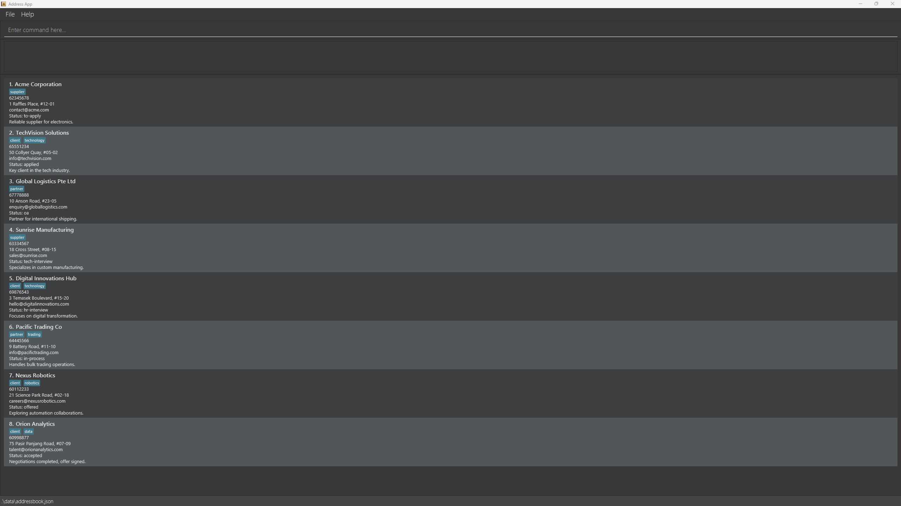
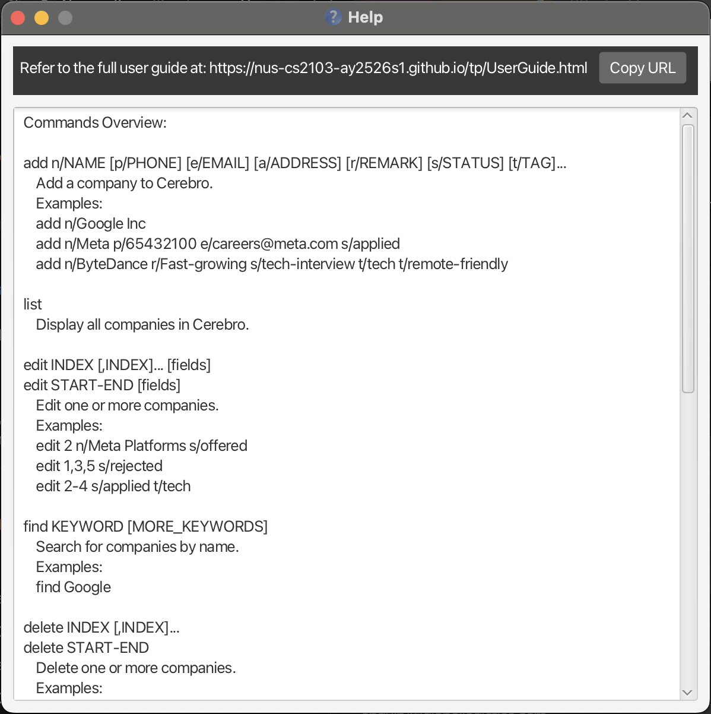
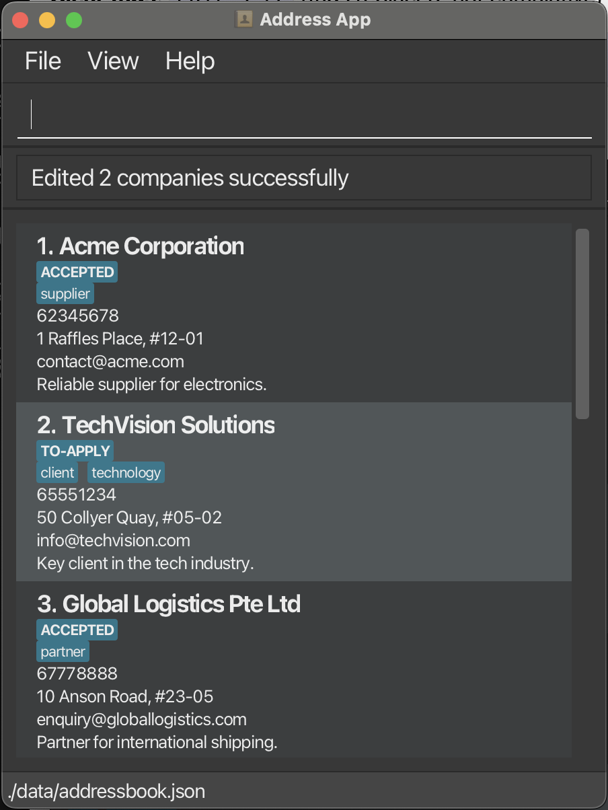
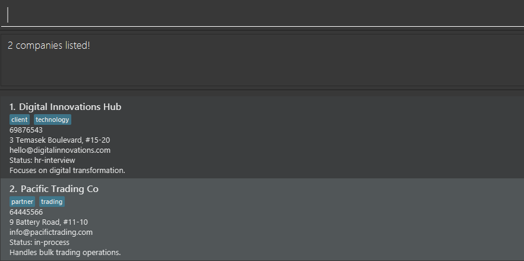

# Cerebro User Guide

## Introduction

**Cerebro** is built for CS students managing multiple internship applications efficiently through a CLI interface. Ideal for users who type fast, prefer structure, and value productivity over point-and-click workflows.

**Prerequisites:** Basic CLI experience, Java 17+, understanding of internship stages (OA, interviews)

<div markdown="block" class="alert alert-info">
**:information_source: Quick Navigation:**<br>
**New users:** Start with [Quick Start](#quick-start)<br>
**Experienced users:** Jump to [Command Summary](#command-summary)<br>
**Search tip:** Use `Ctrl+F` / `Cmd+F` to find specific commands
</div>

**This guide contains:**

* **[Quick Start](#quick-start)** - Installation and first commands
* **[Features](#features)** - Complete command reference
* **[FAQ](#faq)** - Common questions and troubleshooting
* **[Command Summary](#command-summary)** - Quick reference table
* Table of Contents
  {:toc}

---

## Quick Start

### Installation

1. **Check Java Version**

   - Ensure you have Java `17` or above installed.
     - If not, [follow these guides](https://se-education.org/guides/tutorials/javaInstallation.html) to install Java 17 on your system.
     - **Mac users:** Use the specific JDK version from [here](https://se-education.org/guides/tutorials/javaInstallationMac.html)
   - Verify installation: `java --version` in terminal
2. **Download Cerebro**

   - Download the latest `cerebro.jar` from [here](https://github.com/AY2526S1-CS2103T-F08a-1/tp/releases)
   - Choose a folder as your _home folder_ for Cerebro (e.g., `~/Applications/Cerebro/`)
3. **Launch Application**

   ```bash
   cd /path/to/your/cerebro/folder
   java -jar cerebro.jar
   ```

When Cerebro launches, you'll see a clean interface with sample data:



### CLI Tutorial

**Command Structure:** `COMMAND [INDEX] [PARAMETERS]` with prefixes like `n/NAME`, `s/STATUS`, `t/TAG`

**Essential Commands:**

```bash
list                         # View all companies
add n/Google Inc             # Add company (minimal)
add n/Meta s/applied t/tech  # Add with details
remark 1 r/Closed down.      # Update status
status 1 s/tech-interview    # Update status
find Google Meta             # Search companies
edit 1,3,5 s/rejected        # Batch update (no spaces in indices)
delete 3                     # Remove company
```

<div markdown="span" class="alert alert-danger">:exclamation: **Warning:**
Delete operations are permanent! No undo available.
</div>

**Typical Workflow:**

1. **Research:** `add n/CompanyName` (quick entry)
2. **Apply:** `edit 1 s/applied r/Applied via website`
3. **Interview:** `status 1 s/tech-interview`
4. **Organize:** `find KEYWORD` to filter, `list` to see all

**Power Tips:**

- **Batch edit/delete:** `delete 1,2,5-7` (indices 1, 2, 5, 6, 7)
- **Flexible input:** Parameters work in any order

Ready for the complete command reference? Jump to [Features](#features).

---

## Features

<div markdown="block" class="alert alert-info">

**:information_source: Notes about the command format:**<br>

* Words in `UPPER_CASE` are the parameters to be supplied by the user.<br>
  e.g. in `add n/NAME`, `NAME` is a parameter which can be used as `add n/John Doe`.
* Items in square brackets are optional.<br>
  e.g `n/NAME [t/TAG]` can be used as `n/John Doe t/friend` or as `n/John Doe`.
* Items with `…` after them can be used multiple times including zero times.<br>
  e.g. `[t/TAG]…` can be used as ` ` (i.e. 0 times), `t/friend`, `t/friend t/family` etc.
* Parameters can be in any order.<br>
  e.g. if the command specifies `n/NAME p/PHONE_NUMBER`, `p/PHONE_NUMBER n/NAME` is also acceptable.
* Extraneous parameters for commands that do not take in parameters (such as `help`, `list`, `exit` and `clear`) will be ignored.<br>
  e.g. if the command specifies `help 123`, it will be interpreted as `help`.
* If you are using a PDF version of this document, be careful when copying and pasting commands that span multiple lines as space characters surrounding line-breaks may be omitted when copied over to the application.

</div>

### Viewing help : `help`

Shows a message explaining how to access the help page.



Format: `help`

### Adding a company: `add`

Adds a company to Cerebro. Only company name required - other fields optional.

**Format:** `add n/NAME [p/PHONE] [e/EMAIL] [a/ADDRESS] [r/REMARK] [s/STATUS] [t/TAG]...`

<div markdown="block" class="alert alert-success">
**Quick Facts:**
* **Required:** Company name only
* **Optional:** All other fields (auto-filled with placeholders if empty)
* **Default status:** `to-apply`
* **Tags:** Multiple allowed
</div>

**Valid STATUS values:** `to-apply`, `applied`, `oa`, `tech-interview`, `hr-interview`, `in-process`, `offered`, `accepted`, `rejected`

<div markdown="span" class="alert alert-primary">:bulb: **Tip:**
Start with just the company name for quick entry when you're researching companies, then update details later with the `edit` command!
</div>

Examples:

* `add n/Google Inc` - Creates entry with just the name and placeholder values for other fields
* `add n/Meta e/careers@meta.com s/applied` - Adds name, email, and status only
* `add n/ByteDance p/12345678 e/recruit@bytedance.com a/Singapore Science Park r/Fast-growing s/tech-interview t/tech t/remote-friendly` - Adds complete entry with all details

### Listing all companies : `list`

Shows a list of all companies in Cerebro.

Format: `list`

* Displays all companies with their details
* Resets any active filters from previous `find` commands
* Shows companies with their current index numbers

### Editing a company : `edit`

Edits an existing company in Cerebro. Supports single edit and batch edit.

**Format:** `edit INDEX(ES) [n/NAME] [p/PHONE] [e/EMAIL] [a/ADDRESS] [r/REMARK] [s/STATUS] [t/TAG]…`

**Examples:**

**Single:** `edit 1 p/91234567 e/careers@google.com` (any fields allowed)
```
Edited Company 1: Phone: 91234567; Email: careers@google.com; ...
```

**Comma:** `edit 1, 3, 5 s/rejected` (status/remarks/tags only, spaces OK but no trailing comma)
```
Edited 3 companies (indices 1, 3, 5) - Status updated to rejected
```

**Range:** `edit 2-4 s/applied` (inclusive range)
```
Edited 3 companies (indices 2, 3, 4) - Status updated to applied
```

* Edits multiple companies at once with the same changes
* **Comma-Separated:** `edit INDEX,INDEX,INDEX` - Separate specific indices with commas (no spaces)
* **Range:** `edit START-END` - Edits all companies from START to END index (inclusive)
* Must have at least 1 field to edit
* Can only edit tags, status, or remarks for batch editing
* Useful for updating status or tags for multiple companies simultaneously

**Clear tags:** `edit 3 t/` (tags replaced, not cumulative)
```
Edited Company 3 - All tags cleared
```

**Batch edit in action:** `edit 1,3,5 s/rejected`



<div markdown="block" class="alert alert-danger">
**:exclamation: Important - Index Reference:**<br>
Indices refer to the numbers shown in the **current displayed list**. After using `find`, edit indices 1,2,3 refer to the 1st, 2nd, 3rd companies in the filtered results, not the original full list.
</div>

<div markdown="span" class="alert alert-primary">:bulb: **Tip:**
Use batch editing after deadlines: `edit 1-10 s/applied` updates all at once!
</div>

**Valid STATUS values:** `to-apply`, `applied`, `oa`, `tech-interview`, `hr-interview`, `in-process`, `offered`, `accepted`, `rejected`

### Locating companies by name: `find`

Finds companies by name keywords. Case-insensitive, lists all companies that **contains** the keyword.

**Format:** `find KEYWORD [MORE_KEYWORDS]`

<div markdown="block" class="alert alert-success">
**Search Rules:**
* **Case-insensitive** - `google` matches `Google`
* **Keyword order flexible** - `Google Meta` = `Meta Google`
* **Substrings allowed** - `Go` will show `Google`, and all other companies with 'go' in their name
* **OR search** - `Google Meta` finds both `Google Inc` AND `Meta Platforms`
</div>

**Examples:**

* `find go` → `Google Inc`, `Google Singapore`, `Golden Logistics`
* `find digital pacific` → `Digital Innovations Hub`, `Pacific Trading Co`

**Result for 'find digital pacific: **


### Deleting a company : `delete`

Deletes one or more companies from Cerebro. Supports single deletion, batch deletion.

**Format:** `delete INDEX [MORE_INDICES]` or `delete START-END`

* Deletes the company(ies) at the specified index/indices
* The index refers to the index number shown in the displayed company list
* The index **must be a positive integer** 1, 2, 3, …​
* **Single deletion:** `delete INDEX` - Deletes one company
* **Comma-Separated deletion:** `delete INDEX,INDEX,INDEX` - Deletes multiple companies (separate with commas)
* **Range deletion:** `delete START-END` - Deletes all companies from START to END index (inclusive)
* Duplicate indices are ignored (first occurrence kept)
* All specified companies are deleted in a single operation

Examples:

* `delete 2` - Deletes the 2nd company
* `delete 1,3,5` - Deletes the 1st, 3rd, and 5th companies
* `delete 2-4` - Deletes companies at indices 2, 3, and 4
* `list` followed by `delete 2` - Deletes the 2nd company in the full list
* `find Google` followed by `delete 1` - Deletes the 1st company in the filtered results

### Updating application status: `status`

Updates the application status of a company to track your internship application progress.

Format: `status INDEX s/STATUS`

* Updates the status of the company at the specified `INDEX`
* The index refers to the index number shown in the displayed company list
* The index **must be a positive integer** 1, 2, 3, …
* Status is **case-insensitive** (e.g., `APPLIED` and `applied` both work)

**Valid STATUS values:**

* `to-apply` - Not yet applied (default for new entries)
* `applied` - Application submitted
* `oa` - Online Assessment stage
* `tech-interview` - Technical interview scheduled/in progress
* `hr-interview` - HR/behavioral interview
* `in-process` - General process stage
* `offered` - Internship offer received
* `accepted` - Offer accepted
* `rejected` - Application rejected

<div markdown="span" class="alert alert-primary">:bulb: **Tip:**
Use status to track your application pipeline! You can also use the `edit` command to update status along with other fields.
</div>

Examples:

* `status 1 s/tech-interview` - Updates the 1st company's status to "tech-interview"
* `status 3 s/rejected` - Updates the 3rd company's status to "rejected"
* `status 5 s/offered` - Updates the 5th company's status to "offered"

### Adding or editing remarks: `remark`

Adds, edits, or deletes remarks for a company. Remarks are useful for adding notes about the company or your application.

Format: `remark INDEX r/[REMARK]`

* Adds or updates the remark for the company at the specified `INDEX`
* The index refers to the index number shown in the displayed company list
* The index **must be a positive integer** 1, 2, 3, …
* To **delete a remark**, use `remark INDEX r/` (leave the remark field empty)
* Existing remark will be overwritten with the new remark

Examples:

* `remark 1 r/Great company culture, flexible hours` - Adds/updates remark for the 1st company
* `remark 2 r/Referral from John Doe` - Adds/updates remark for the 2nd company
* `remark 3 r/` - Deletes the remark for the 3rd company

### Clearing all entries : `clear`

Clears all companies from Cerebro.

Format: `clear`

<div markdown="span" class="alert alert-warning">:exclamation: **Caution:**
This action cannot be undone! All company data will be permanently deleted.
</div>

### Exiting the program : `exit`

Exits the program.

Format: `exit`

### Saving the data

Cerebro data is saved in the hard disk automatically after any command that changes the data. There is no need to save manually.

### Editing the data file

Cerebro data is saved automatically as a JSON file `[JAR file location]/data/addressbook.json`. Advanced users are welcome to update data directly by editing that data file.

<div markdown="span" class="alert alert-warning">:exclamation: **Caution:**
If your changes to the data file make its format invalid, Cerebro will discard all data and start with an empty data file at the next run. Hence, it is recommended to take a backup of the file before editing it.<br>
Furthermore, certain edits can cause Cerebro to behave in unexpected ways (e.g., if a value entered is outside of the acceptable range). Therefore, edit the data file only if you are confident that you can update it correctly.
</div>

### Archiving data files `[coming in v2.0]`

_Details coming soon ..._

---

## FAQ

**Q**: What happens if I add a company with the same name?<br>
**A**: Company names must be unique (case-insensitive). Cerebro rejects duplicates and shows an error message.

**Q**: How do I track multiple roles at the same company?<br>
**A**: Use tags to differentiate positions (`add n/Google SWE` vs `add n/Google PM`) or add role details in remarks.

**Q**: Can I undo a delete or clear operation?<br>
**A**: No, deletions are permanent. Restore from backup by copying your `addressbook.json` file back to the data folder before restarting.

**Q**: How do I transfer my data to another computer?<br>
**A**: Install Cerebro on the new computer, then overwrite the empty data file with your existing `[JAR location]/data/addressbook.json`.

**Q**: Can I edit the JSON file directly?<br>
**A**: Yes, advanced users can edit `addressbook.json` directly. **Always backup first** - invalid format will cause Cerebro to discard all data.

**Q**: What's the difference between `status` and `edit` commands?<br>
**A**: `status` updates only the status field quickly. `edit` updates status plus other fields in one command. Use whichever is more convenient.

---

## Known issues

1. **When using multiple screens**, if you move the application to a secondary screen, and later switch to using only the primary screen, the GUI will open off-screen. The remedy is to delete the `preferences.json` file created by the application before running the application again.

--------------------------------------------------------------------------------------------------------------------

## Command summary

Action | Format | Examples
--------|--------|----------
**Add** | `add n/NAME [p/PHONE] [e/EMAIL] [a/ADDRESS] [r/REMARK] [s/STATUS] [t/TAG]…​` | `add n/Google Inc`<br>`add n/Meta p/65432100 e/careers@meta.com`<br>`add n/Apple r/Great benefits s/applied`
**List** | `list` | `list`
**Edit (Single)** | `edit INDEX [n/NAME] [p/PHONE] [e/EMAIL] [a/ADDRESS] [r/REMARK] [s/STATUS] [t/TAG]…​` | `edit 2 n/Meta Platforms s/offered`
**Edit (Comma-Separated)** | `edit INDEX,INDEX,INDEX [fields]` | `edit 1,3,5 s/rejected`
**Edit (Range)** | `edit START-END [fields]` | `edit 2-4 s/applied t/tech`
**Find** | `find KEYWORD [MORE_KEYWORDS]` | `find Google Meta`
**Delete (Single)** | `delete INDEX` | `delete 3`
**Delete (Comma-Separated)** | `delete INDEX [MORE_INDICES]` | `delete 1 3 5`
**Delete (Range)** | `delete START-END` | `delete 2-4`
**Status** | `status INDEX s/STATUS` | `status 1 s/tech-interview`
**Remark** | `remark INDEX r/[REMARK]` | `remark 1 r/Great company culture`
**Clear** | `clear` | `clear`
**Help** | `help` | `help`
**Exit** | `exit` | `exit`

### Valid Status Values

`to-apply`, `applied`, `oa`, `tech-interview`, `hr-interview`, `in-process`, `offered`, `accepted`, `rejected`
