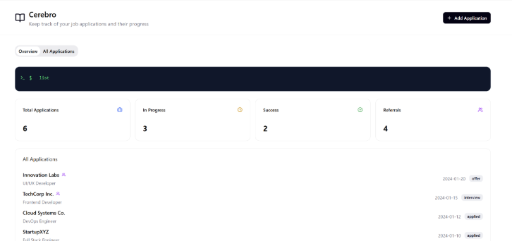

Cerebro is a **desktop app for managing internship companies progress, optimized for use via a Command Line Interface** (CLI) while still having the benefits of a Graphical User Interface (GUI). If you can type fast, Cerebro can get your application tracking tasks done faster than traditional GUI apps.

--------------------------------------------------------------------------------------------------------------------

## Quick start

1. Ensure you have Java `17` or above installed in your Computer. 
   **Mac users:** Ensure you have the precise JDK version prescribed [here](https://se-education.org/guides/tutorials/javaInstallationMac.html).

2. Download the latest `.jar` file from **Releases** page of this repository.

3. Copy the file to the folder you want to use as the _home folder_ for your Cerebro.

4. Open a command terminal, `cd` into the folder you put the jar file in, and use the `java -jar cerebro.jar` command to run the application. 
   A GUI similar to the below should appear in a few seconds. Note how the app contains some sample data. 
   

5. Type the command in the command box and press Enter to execute it. e.g. typing **`help`** and pressing Enter will open the help window. 
   Some example commands you can try:

    * `list` : Lists all companies.

    * `add n/Google p/67676767 e/google@example.com a/Goggles street, block 123, #01-01 r/FAANG Jackpot t/pending-interview` : Adds a company named `Google` to the Application List.

    * `delete 3` : Deletes the 3rd contact shown in the current list.

    * `clear` : Deletes all companies.

    * `exit` : Exits the app.

6. Refer to the [Features](#features) below for details of each command.

--------------------------------------------------------------------------------------------------------------------

## Features

**:information_source: Notes about the command format:** 

* Words in `UPPER_CASE` are the parameters to be supplied by the user. 
  e.g. in `add n/NAME`, `NAME` is a parameter which can be used as `add n/Google`.

* Items in square brackets are optional. 
  e.g `n/NAME [t/TAG]` can be used as `n/Google t/remote-work` or as `n/Google`.

* Items with `…`​ after them can be used multiple times including zero times. 
  e.g. `[t/TAG]…​` can be used as ` ` (i.e. 0 times), `t/remote-work`, `t/remote-work t/good-salary` etc.

* Parameters can be in any order. 
  e.g. if the command specifies `n/NAME p/PHONE_NUMBER`, `p/PHONE_NUMBER n/NAME` is also acceptable.

* Extraneous parameters for commands that do not take in parameters (such as `help`, `list`, `exit` and `clear`) will be ignored. 
  e.g. if the command specifies `help 123`, it will be interpreted as `help`.

* If you are using a PDF version of this document, be careful when copying and pasting commands that span multiple lines as space characters surrounding line-breaks may be omitted when copied over to the application.

### Viewing help : `help`

Shows a message explaining how to access the help page.

Format: `help`

### Adding a company: `add`

Adds a company to the application tracker.

You can also set an application status when adding:
`add n/NAME p/PHONE_NUMBER e/EMAIL a/ADDRESS r/REMARK [s/STATUS] [t/TAG]...`

- Valid `STATUS` values: `to-apply`, `applied`, `in-process`, `offered`, `rejected`.
- If `s/STATUS` is omitted, status defaults to `to-apply`.

Format: `add n/NAME [p/PHONE_NUMBER] [e/EMAIL a/ADDRESS] [r/REMARKS] [s/STATUS] [t/TAG]…​`

:bulb: **Tip:**
A company can have any number of tags (including 0)

Examples:
* `add n/Figma`
* `add n/Google p/18301893 e/google@example.com a/Goggles street, block 123, #01-01`
* `add n/LinkedIn e/linkedin@example.com a/Pulau Tekong p/67676767 t/remote-work`

### Listing all companies : `list`

Shows a list of all companies in the address book.

Format: `list`

### Editing a company : `edit`

Edits an existing company in the address book.

Format: `edit INDEX[,INDEX]... [n/NAME] [p/PHONE] [e/EMAIL] [a/ADDRESS] [r/REMARKS] [s/STATUS] [t/TAG]…​`

* Edits the company at the specified `INDEX/INDICES`. The indices refers to the index number shown in the displayed company list. The index/indices **must be a present and is a positive integer** 1, 2, 3, …​
* Batch edits feature can only be used for editing `[r/REMARKS] [s/STATUS] [t/TAG]`
* Multiple indices input has to be separated by commas
* At least one of the optional fields must be provided.
* All provided fields are applied to each specified company.
* When editing tags, the existing tags of the company will be removed i.e adding of tags is not cumulative.
* You can remove all the company’s tags by typing `t/` without
  specifying any tags after it.

Examples:
*  `edit 1 p/91234567 e/google@example.com` Edits the phone number and email address of the 1st company to be `91234567` and `johndoe@example.com` respectively.
*  `edit 2 n/Betsy Crower t/` Edits the name of the 2nd company to be `Betsy Crower` and clears all existing tags.
*  `edit 1,3 s/offered` Edits the status of the 1st company and 3rd company to `offered`.

### Locating companies by name: `find`

Finds companies whose names contain any of the given keywords.

Format: `find KEYWORD [MORE_KEYWORDS]`

* The search is case-insensitive. e.g `google` will match `Google`
* The order of the keywords does not matter. e.g. `Google Inc.` will match `Inc. Google`
* Only the name is searched.
* Only full words will be matched e.g. `Googl` will not match `Google`
* Companies matching at least one keyword will be returned (i.e. `OR` search).
  e.g. `Google Inc.` will return `Google Co.`, `Apple Inc.`

Examples:
* `find Google` returns `Google Inc.` and `Google Co.`
* `find Google Research` returns `Google Inc.`, `Huawei Reasearch Foundation` 
  

### Deleting a company : `delete`

Deletes the specified company from the address book.

Format: `delete INDEX[, INDEX]`

* Deletes the company at the specified `INDEX/INDICES`.
* The index/indices refers to the index number shown in the displayed company list.
* The index/indices **must be a positive integer** 1, 2, 3, …​
* Indices input has to be separated by commas
* The command allows random ordering index.

Examples:
* `list` followed by `delete 2, 1, 5 ` deletes the 1st, 2nd, and 5th company in the list.
* `find Betsy` followed by `delete 1` deletes the 1st company in the results of the `find` command.

### Updating application status: `status`

Changes only the application status of a company.

Format: `status INDEX s/STATUS`

- Valid `STATUS` values: `to-apply`, `applied`, `in-process`, `offered`, `rejected`.

Examples:
* `status 1 s/in-process`
* `status 3 s/rejected`

### Clearing all entries : `clear`

Clears all entries from the address book.

Format: `clear`

### Exiting the program : `exit`

Exits the program.

Format: `exit`

### Saving the data

Company data are saved in the hard disk automatically after any command that changes the data. There is no need to save manually.

### Editing the data file

Company data are saved automatically as a JSON file `[JAR file location]/data/addressbook.json`. Advanced users are welcome to update data directly by editing that data file.

:exclamation: **Caution:**
If your changes to the data file makes its format invalid, AddressBook will discard all data and start with an empty data file at the next run. Hence, it is recommended to take a backup of the file before editing it. 
Furthermore, certain edits can cause the AddressBook to behave in unexpected ways (e.g., if a value entered is outside of the acceptable range). Therefore, edit the data file only if you are confident that you can update it correctly.

### Archiving data files `[coming in v2.0]`

_Details coming soon ..._

--------------------------------------------------------------------------------------------------------------------

## FAQ

**Q**: How do I transfer my data to another Computer? 
**A**: Install the app in the other computer and overwrite the empty data file it creates with the file that contains the data of your previous AddressBook home folder.

--------------------------------------------------------------------------------------------------------------------

## Known issues

1. **When using multiple screens**, if you move the application to a secondary screen, and later switch to using only the primary screen, the GUI will open off-screen. The remedy is to delete the `preferences.json` file created by the application before running the application again.
2. **If you minimize the Help Window** and then run the `help` command (or use the `Help` menu, or the keyboard shortcut `F1`) again, the original Help Window will remain minimized, and no new Help Window will appear. The remedy is to manually restore the minimized Help Window.

--------------------------------------------------------------------------------------------------------------------

## Command summary

Action | Format, Examples
--------|------------------
**Add** | `add n/NAME [p/PHONE_NUMBER] [e/EMAIL] [a/ADDRESS] [r/REMARKS] [t/TAG]…​`   e.g., `add n/Facebook p/76395739 e/Facebook@example.com a/354, Clementi Rd, 3544665 r/FAANG Jackpot s/offered t/remote-work`
**Clear** | `clear`
**Delete** | `delete <INDEX OR INDICES>`  e.g., `delete 3` or `delete 3, 4, 9`
**Edit** | `edit INDEX [n/NAME] [p/PHONE_NUMBER] [e/EMAIL] [a/ADDRESS] [t/TAG]…​`  e.g.,`edit 2 n/James Lee e/jameslee@example.com`
**Find** | `find KEYWORD [MORE_KEYWORDS]`  e.g., `find James Jake`
**List** | `list`
**Status** | `status`
**Filter** | `filter`
**Remark** | `remark`
**Help** | `help`
**Status** | `status INDEX s/STATUS`  e.g., `status 1 s/offered`
**Exit** | `exit`