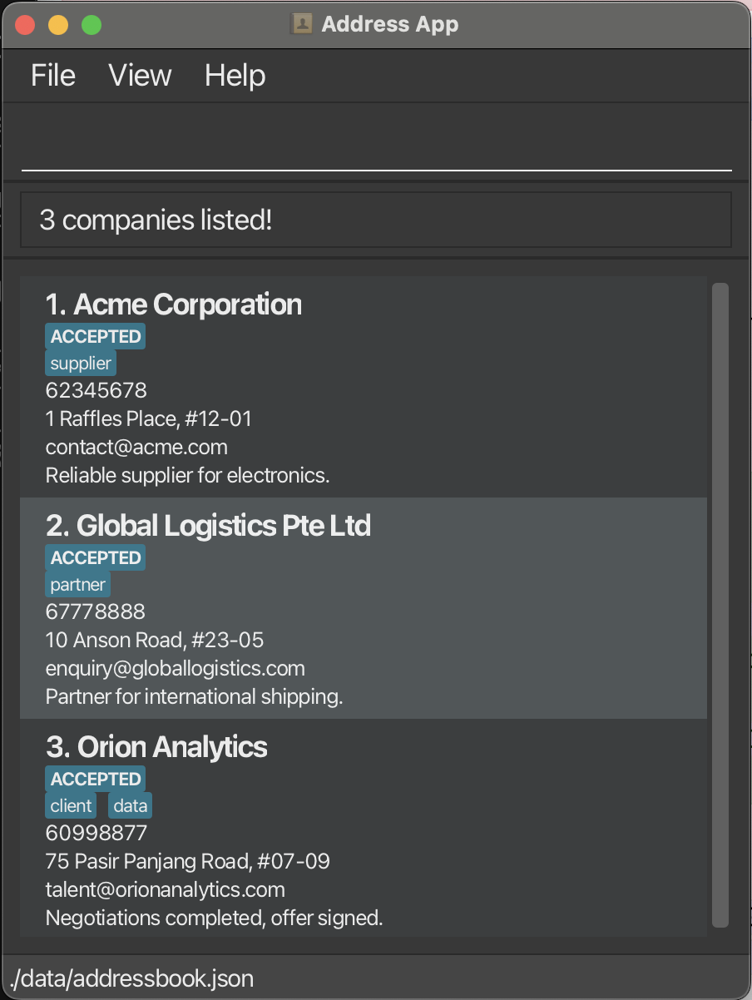

## Introduction

**Cerebro** is built for CS students managing multiple internship applications efficiently through a CLI interface. Ideal for users who type fast, prefer structure, and value productivity over point-and-click workflows.

**Prerequisites:** Basic CLI experience, Java 17+, understanding of internship stages (OA, interviews)

<div markdown="block" class="alert alert-info">
**:information_source: Quick Navigation:**<br>
**New users:** Start with [Quick Start](#quick-start)<br>
**Experienced users:** Jump to [Command Summary](#command-summary)<br>
**Search tip:** Use `Ctrl+F` / `Cmd+F` to find specific commands
</div>

**This guide contains:**

* **[Table of Contents](#table-of-contents)** - Full table of contents
* **[Quick Start](#quick-start)** - Installation and first commands
* **[CLI Tutorial](#cli-tutorial)** - Command format and important information
* **[Company Fields](#company-fields)** - Summary of fields available a Company and their valid values
* **[Commands](#Commands)** - Complete command reference
* **[FAQ](#faq)** - Common questions and troubleshooting
* **[Command Summary](#command-summary)** - Quick reference table

## Table of Contents

* Table of Contents
{:toc}

---

## Quick Start

### Installation

1. **Check Java Version**

   - Ensure you have Java `17` or above installed.
     - If not, [follow these guides](https://se-education.org/guides/tutorials/javaInstallation.html) to install Java 17 on your system.
     - **Mac users:** Use the specific JDK version from [here](https://se-education.org/guides/tutorials/javaInstallationMac.html)
   - Verify installation: `java --version` in terminal
2. **Download Cerebro**

   - Download the latest `cerebro.jar` from [here](https://github.com/AY2526S1-CS2103T-F08a-1/tp/releases)
   - Choose a folder as your _home folder_ for Cerebro (e.g., `~/Applications/Cerebro/`)
3. **Launch Application**

   ```bash
   cd /path/to/your/cerebro/folder
   java -jar cerebro.jar
   ```

When Cerebro launches, you'll see a clean interface with sample data:


### CLI Tutorial

<div markdown="block" class="alert alert-info">

**:information_source: Notes about the command format:**<br>

* Words in `UPPER_CASE` are the parameters to be supplied by the user.<br>
  * e.g. in `add n/NAME`, `NAME` is a parameter which can be used as `add n/John Doe`.
* For items in angle brackets, and separated by a pipe `|`, exactly one of the items are required.<br>
  * e.g `<INDEX|START-END>` can be used as `1` or as `1-2`.
  * e.g `<s/STATUS|t/TAG>` can be used as `s/applied` or as `t/good-pay`.
* Items in square brackets are optional.<br>
  * e.g `n/NAME [t/TAG]` can be used as `n/John Doe t/friend` or as `n/John Doe`.
* Items with `…` after them can be used multiple times including zero times.<br>
  * e.g. `[t/TAG]…` can be used as ` ` (i.e. 0 times), `t/friend`, `t/friend t/family` etc.
* Parameters can be in any order.<br>
  * e.g. if the command specifies `n/NAME p/PHONE_NUMBER`, `p/PHONE_NUMBER n/NAME` is also acceptable.
* Extraneous parameters for commands that do not take in parameters (such as `help`, `list`, `exit` and `clear`) will be ignored.<br>
  * e.g. if the command specifies `help 123`, it will be interpreted as `help`.
* Use a backslash `\` to escape command prefixes e.g. in your remark
  * e.g. `add n/Company r/This is a remark with a \r/ for some reason` -> Remark: This is a remark with a r/ for some reason
* If you are using a PDF version of this document, be careful when copying and pasting commands that span multiple lines as space characters surrounding line-breaks may be omitted when copied over to the application.

</div>

**Command Structure:** `COMMAND [INDEX] [PARAMETERS]` with prefixes like `n/NAME`, `s/STATUS`, `t/TAG`

<div markdown="span" class="alert alert-danger">:exclamation: **Warning:**
All operations are permanent! No undo available.
</div>

**Typical Workflow:**

1. **Research:** `add n/CompanyName` (quick entry)
2. **Add details:** `edit 1 e/contact_email@example.com a/Sample Address #00-00`
3. **Apply:** `edit 1 s/applied r/Applied via website`
4. **View info** `find CompanyName`
5. **Interview:** `edit 1 s/tech-interview`
6. **Overview:** `filter s/SUBSTRING` to filter by status, `list` to see all

**Power Tips:**

- **Batch edit/delete:** `delete 1,2,5-7` (indices 1, 2, 5, 6, 7)
- **Flexible input:** Parameters work in any order

---

## Company Fields

| Field      | Requirements                                                                                                     | Valid Examples                     | Invalid Examples                  |
|------------|-----------------------------------------------------------------------------------------------------------------|-------------------------------------|------------------------------------|
| **Name**   | Only alphanumeric characters and spaces, cannot be blank                                                        | `Google`, `Meta Inc`               | `@Google`, `Meta!`, `""` (blank)          |
| **Phone**  | At least 3 digits, may start with `+`, may contain single spaces between digits                                  | `98765432`, <br>`+65 9123 4567`        | `12`, `+65 9123  4567`,<br>`91+234567`            |
| **Email**  | Format: local-part@domain. Local-part: alphanumeric + `+_.-`, no special chars at start/end. Domain: valid labels | `john.doe@example.com`             | `john..doe@example.com`, `@test`  |
| **Address**| Free text                                                                                                       | `123 Main St, #01-01`              | -                                  |
| **Status** | One of: `to-apply`, `applied`, `oa`, `tech-interview`, `hr-interview`, `in-process`, `offered`, `accepted`, `rejected` | `applied`, `offered`               | `pending`, `done`                 |
| **Tag**    | Max 30 characters, hyphen-separated words. Case-insensitive.                                                            | `remote-work`, `tech-role`, `GreAT-loCaTion`         | `remote work`, `this-is-way-too-long-for-a-tag` |
| **Remark** | Free text                                                                                                       | `Met at career fair`               | -                                  |

## Commands

<div markdown="span" class="alert alert-warning">:exclamation: **Caution:**
Make sure you familiarise yourself with the [command format](#cli-tutorial) used in this User Guide first!
</div>

### Viewing help : `help`

Shows a message explaining how to access the help page.


<div markdown="span" class="alert alert-primary">:bulb: **Tip:**
You can close the help window with the `ESC` key, `Ctrl/Cmd` + `W` or `alt` + `f4`
</div>

### Listing all companies : `list`

Shows a list of all companies in Cerebro.

* Displays all companies with their details
* Resets any active filters from previous `find` commands
* Shows companies with their current index numbers

### Filtering companies by status and/or tag: `filter`

Finds companies by status and/or tag values. Case-insensitive, lists all companies that **matches** the status AND **matches** **any** of the tags as substrings.

**Format:** `filter <s/STATUS|t/TAG> [t/TAG]…`

<div markdown="block" class="alert alert-success">
**Usage:**
* **Required:** At least one criteria
* **Optional:** status criteria and additional tag critera
* **Statuses:** matched by exact match
* **Tags:** Multiple allowed, matched by substring
</div>

**Examples:**

`filter s/in-process`,<br>`filter t/remote-friendly t/good-pay`,<br>`filter s/applied t/tech`

**Result for `filter s/applied t/cl t/og`:**



### Locating companies by name: `find`

Finds companies by matching name substring. Case-insensitive, lists all companies that **contains** the substring.

**Format:** `find SUBSTRING [SUBSTRING]…`

<div markdown="block" class="alert alert-success">
**Search Rules:**
* **Case-insensitive** - `google` matches `Google`
* **Substring order flexible** - `Google Meta` = `Meta Google`
* **Substrings allowed** - `Go` will show `Google`, and all other companies with 'go' in their name
* **OR search** - `Google Meta` finds both `Google Inc` AND `Meta Platforms`
</div>

**Examples:**

* `find Google TikTok` → `Google Inc`, `Google Singapore`, `TikTok`
* `find goOgl iktO` → `Google Inc`, `Google Singapore`, `TikTok`

**Result for `find digital pacific`:**


### Viewing companies metrics: `metrics`

Displays a summary of how your internship applications are distributed across different statuses (e.g., Applied, Offered, Rejected) for all companies you’ve added.

**Result for `metrics`:**


<div markdown="span" class="alert alert-primary">:bulb: **Tip:**
You can close the metrics window with the `ESC` key, `Ctrl/Cmd` + `W` or `alt` + `f4`
</div>

### Adding a company: `add`

Adds a company to Cerebro.

**Format:** `add n/NAME [p/PHONE] [e/EMAIL] [a/ADDRESS] [r/REMARK] [s/STATUS] [t/TAG]…`

<div markdown="block" class="alert alert-success">
**Usage:**
* **Required:** Company name only
* **Optional:** All other fields
* **Default status:** `to-apply`
* **Tags:** Multiple allowed
</div>

**Examples:**

* `add n/Google Inc` - Creates entry with just the name and placeholder values for other fields
* `add n/Meta e/careers@meta.com s/applied` - Adds name, email, and status only
* `add n/ByteDance p/12345678 e/recruit@bytedance.com a/Singapore Science Park r/Fast-growing s/tech-interview t/tech t/remote-friendly` - Adds complete entry with all details

<div markdown="span" class="alert alert-primary">:bulb: **Tip:**
Start with just the company name for quick entry when you're researching companies, then update details later with the `edit` command!
</div>

### Editing a company : `edit`

Edits an existing company in Cerebro. Supports single edit and batch edit.

**Format:** `edit <INDEX|START-END> [INDEX]… [START-END]… [n/NAME] [p/PHONE] [e/EMAIL] [a/ADDRESS] [r/REMARK] [s/STATUS] [t/TAG]…​`

**Examples:**

**Single:** `edit 1 p/91234567 e/careers@google.com`
```
Edited Company 1: Phone: 91234567; Email: careers@google.com; …
```

**Comma:** `edit 1, 3, 5 s/rejected`
<div markdown="block" class="alert alert-success">
 * **batch edit fields:** status/remarks/tags only
 * **batch edit indices:** spaces OK but no trailing comma
</div>
```
Edited 3 companies (indices 1, 3, 5) - Status updated to rejected
```

**Range:** `edit 2-4 s/applied` (inclusive range)
```
Edited 3 companies (indices 2, 3, 4) - Status updated to applied
```
<div markdown="block" class="alert alert-success">
* Edits multiple companies at once with the same changes
* **Comma-Separated:** `edit INDEX,INDEX,INDEX` - Separate specific indices with commas (no spaces)
* **Range:** `edit START-END` - Edits all companies from `START` to `END` index (inclusive)
  * the `START` index must be <= the `END` index:
  * 3-6: edits companies 3,4,5,6
  * 3-3: edits company 3
  * 6-3: NOT ALLOWED
* Must have at least 1 field to edit
* Can only edit tags, status, or remarks for batch editing
* Useful for updating status or tags for multiple companies simultaneously
</div>

**Clear tags:** `edit 3 t/`
```
Edited Company 3 - All tags cleared
```
<div markdown="span" class="alert alert-danger">:exclamation: **Caution:** edits will replace existing fields, including replacing all existing tags.
</div>

**Batch edit in action:** `edit 1,3 s/accepted`


<div markdown="block" class="alert alert-danger">
**:exclamation: Important - Index Reference:**<br>
Indices refer to the numbers shown in the **current displayed list**. After using `find`, edit indices 1,2,3 refer to the 1st, 2nd, 3rd companies in the filtered results, not the original full list.
</div>

<div markdown="span" class="alert alert-primary">:bulb: **Tip:**
Use batch editing after deadlines: `edit 1-10 s/applied` updates all at once!
</div>

### Deleting a company : `delete`

Deletes one or more companies from Cerebro. Supports single deletion, batch deletion.

**Format:** `delete <INDEX|START-END> [INDEX]… [START-END]…`

<div markdown="block" class="alert alert-success">
* Deletes the company(ies) at the specified index/indices
* The index refers to the index number shown in the displayed company list
* The index **must be a positive integer** 1, 2, 3, …​
* **Single deletion:** `delete INDEX` - Deletes one company
* **Comma-Separated deletion:** `delete INDEX,INDEX,INDEX` - Deletes multiple companies (separate with commas)
* **Range deletion:** `delete START-END` - Deletes all companies from START to END index (inclusive)
* Duplicate indices are ignored (first occurrence kept)
* All specified companies are deleted in a single operation
</div>

<div markdown="span" class="alert alert-danger">:exclamation: **Caution:**
This action cannot be undone! Company data will be permanently deleted.
</div>

Examples:

* `delete 2` - Deletes the 2nd company
* `delete 1,3,5` - Deletes the 1st, 3rd, and 5th companies
* `delete 2-4` - Deletes companies at indices 2, 3, and 4
* `list` followed by `delete 2` - Deletes the 2nd company in the full list
* `find Google` followed by `delete 1` - Deletes the 1st company in the filtered results
* `filter applied` followed by `delete 1` - Deletes the 1st company in the filtered results of companies with status `applied`

### Clearing all entries : `clear`

Clears all companies from Cerebro.

Format: `clear`

<div markdown="span" class="alert alert-danger">:exclamation: **Caution:**
This action cannot be undone! All company data will be permanently deleted.
</div>

### Exiting the program : `exit`

Exits the program.

Format: `exit`

### Saving the data

Cerebro data is saved in the hard disk automatically after any command that changes the data. There is no need to save manually.

### Editing the data file

Cerebro data is saved automatically as a JSON file `[JAR file location]/data/addressbook.json`. Advanced users are welcome to update data directly by editing that data file.

<div markdown="span" class="alert alert-warning">:exclamation: **Caution:**
If your changes to the data file make its format invalid, **Cerebro will discard all data and start with an empty data file at the next run. Hence, it is recommended to take a backup of the file before editing it.**
<br>Furthermore, certain edits can cause Cerebro to behave in unexpected ways (e.g., if a value entered is outside of the acceptable range). Therefore, edit the data file only if you are confident that you can update it correctly.
</div>

### Upcoming Features
- Archiving & backing up data files
- Undo changes
- Reminders for upcoming deadline

---

## FAQ

**Q: What happens if I add a company with the same name?**
**A**: Company names must be unique (case-insensitive). Cerebro rejects duplicates and shows an error message.

**Q: How do I track multiple roles at the same company?**
**A**: Use tags to differentiate positions (`add n/Google SWE` vs `add n/Google PM`) or add role details in remarks.

**Q: Can I undo a delete or clear operation?**
**A**: No, deletions are permanent. Restore from backup by copying your `addressbook.json` file back to the data folder before restarting.

**Q: How do I transfer my data to another computer?**
**A**: Install Cerebro on the new computer, then overwrite the empty data file with your existing `[JAR location]/data/addressbook.json`.

**Q: Can I edit the JSON file directly?**
**A**: Yes, advanced users can edit `addressbook.json` directly. **Always backup first** - invalid format will cause Cerebro to discard all data.

**Q: How do I regenerate the dummy data?**
**A**: Delete the `/data` folder, then run the app again. **Make sure to backup any important information first!**

--------------------------------------------------------------------------------------------------------------------

## Command summary

### Viewing Commands

Action | Format | Examples
--------|--------|----------
**[List](#listing-all-companies--list)** | `list` | `list`
**[Filter](#filtering-companies-by-status-andor-tag-filter)** | `filter <s/STATUS|t/TAG> [t/TAG]…` | `filter s/in-process`,<br>`filter t/remote-friendly t/good-pay`,<br>`filter s/applied t/tech`
**[Find](#locating-companies-by-name-find)** | `find SUBSTRING [SUBSTRING]…` | `find Google Meta`

### Action Commands

Action | Format | Examples
--------|--------|----------
**[Add](#adding-a-company-add)** | `add n/NAME [p/PHONE] [e/EMAIL] [a/ADDRESS] [r/REMARK] [s/STATUS] [t/TAG]…​` | `add n/Google Inc`,<br>`add n/Meta p/65432100 e/careers@meta.com`,<br>`add n/Apple r/Great benefits s/applied`
**[Edit](#editing-a-company--edit)** | `edit <INDEX|START-END> [INDEX]… [START-END]… [n/NAME] [p/PHONE] [e/EMAIL] [a/ADDRESS] [r/REMARK] [s/STATUS] [t/TAG]…​` | `edit 1 p/91234567 e/googlehr@gmail.com s/applied`, `edit 1,2,4-8 p/91234567 e/googlehr@gmail.com a/70 Pasir Panjang Rd, #03-71 Mapletree Business City II, Singapore 117371 s/applied t/FAANG`
**[Delete (Single)](#deleting-a-company--delete)** | `delete  <INDEX|START-END> [INDEX]… [START-END]…` | `delete 3`, `delete 1,3,5-8`
**[Clear](#clearing-all-entries--clear)** | `clear` | `clear`

### Other Commands

Action | Format | Examples
--------|--------|----------
**[Help](#viewing-help--help)** | `help` | `help`
**[Metrics](#viewing-companies-metrics-metrics)** | `metrics` | `metrics`
**[Exit](#exiting-the-program--exit)** | `exit` | `exit`
