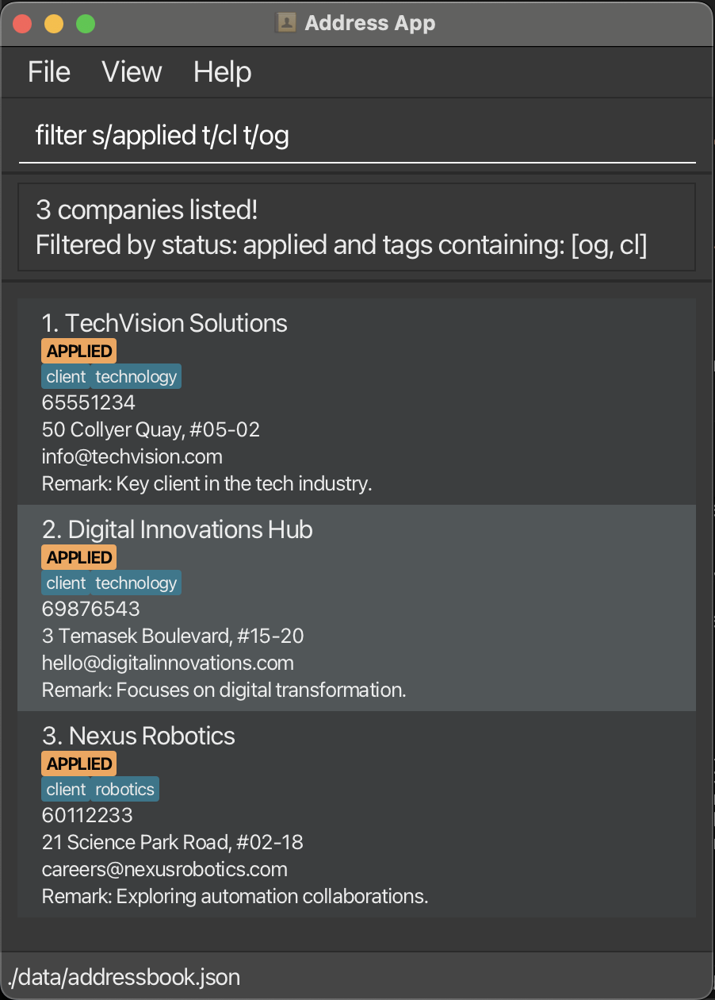

## Introduction

**Cerebro** is built for CS students managing multiple internship applications efficiently through a CLI interface. Ideal for users who type fast, prefer structure, and value productivity over point-and-click workflows.

**Prerequisites:** Basic CLI experience, Java 17+ installed, understanding of internship stages (OA, interviews)

<div markdown="block" class="alert alert-info">
**:information_source: Quick Navigation:**<br>
**New users:** Start with [Quick Start](#quick-start)<br>
**Experienced users:** Jump to [Command Summary](#command-summary)<br>
**Search tip:** Use `Ctrl+F` / `Cmd+F` to find specific commands
</div>


## Table of Contents

Full table of contents for easy navigation through this guide.

* Table of Contents
  {:toc}

---

## Quick Start

Installation and first commands to get you started with Cerebro.

### Installation

1. **Check Java Version**

    - Ensure you have Java `17` or above installed.
        - If not, [follow these guides](https://se-education.org/guides/tutorials/javaInstallation.html) to install Java 17 on your system.
        - **Mac users:** Use the specific JDK version from [here](https://se-education.org/guides/tutorials/javaInstallationMac.html)
    - Verify installation: `java --version` in terminal
2. **Download Cerebro**

    - Download the latest `cerebro.jar` from [here](https://github.com/AY2526S1-CS2103T-F08a-1/tp/releases)
    - Choose a folder as your _home folder_ for Cerebro (e.g. `~/Applications/Cerebro/`)
3. **Launch Application**

   ```bash
   cd /path/to/your/cerebro/folder
   java -jar cerebro.jar
   ```

After running `java -jar cerebro.jar`, you should see a window similar to below, preloaded with sample companies.


### CLI Tutorial

Command format and important information about using Cerebro's command line interface.

<div markdown="block" class="alert alert-info">

**:information_source: Notes about the command format:**<br>

* Words in `UPPER_CASE` are the parameters to be supplied by the user.<br>
  e.g. in `add n/NAME`, `NAME` is a parameter which can be used as `add n/John Doe`.
* Items in square brackets are optional.<br>
  e.g `n/NAME [t/TAG]` can be used as `n/John Doe t/friend` or as `n/John Doe`.
* Items with `…` after them can be used multiple times including zero times.<br>
  e.g. `[t/TAG]…` can be used as ` ` (i.e. 0 times), `t/friend`, `t/friend t/family` etc.
* Parameters can be in any order.<br>
  e.g. if the command specifies `n/NAME p/PHONE_NUMBER`, `p/PHONE_NUMBER n/NAME` is also acceptable.
* Extraneous parameters for commands that do not take in parameters (such as `help`, `list`, `exit`, `clear` and `metrics`) will be ignored.<br>
  e.g. if the command specifies `help 123`, it will be interpreted as `help`.
* If you are using a PDF version of this document, be careful when copying and pasting commands that span multiple lines as space characters surrounding line-breaks may be omitted when copied over to the application.

</div>

**Command Structure:** `command [index] [parameters]` with prefixes like `n/NAME`, `s/STATUS`, `t/TAG`

<div markdown="span" class="alert alert-danger">:exclamation: **Warning:**
All operations are permanent! No undo available.
</div>

**Typical Workflow:**

1. **Research:** `add n/CompanyName` (quick entry)
2. **Add details:** `edit 1 e/contact_email@example.com a/Sample Address #00-00`
3. **Apply:** `edit 1 s/applied r/Applied via website`
4. **View info** `find CompanyName`
5. **Interview:** `edit 1 s/tech-interview`
6. **Overview:** `filter s/KEYWORD` to filter by status, `list` to see all

<div markdown="span" class="alert alert-primary">:bulb: **Power Tips:**
**Batch edit/delete:** `delete 1,2,5-7` (indices 1, 2, 5, 6, 7)<br>
**Flexible input:** Parameters work in any order
</div>

---

## Company Fields

Summary of fields available for a Company and their valid values.

| Field      | Requirements                                                                                                     | Valid Examples                      | Invalid Examples                                              |
|------------|-----------------------------------------------------------------------------------------------------------------|-------------------------------------|---------------------------------------------------------------|
| **Name**   | All ASCII characters allowed, cannot be blank. Case-insensitive: `Google` is treated the same as `google`      | `Google`, `J&J`, `@Google`, `Meta!` | ` ` (blank)                                                   |
| **Phone**  | At least 3 digits, may start with `+`, may contain single spaces between digits                                  | `98765432`, <br>`+65 9123 4567`     | `12`, `+65 9123  4567` (double-spaced),<br>`91+234567`        |
| **Email**  | Format: local-part@domain. Local-part: alphanumeric + `+_.-`, no special chars at start/end. Domain: valid labels | `john.doe@example.com`              | `john..doe@example.com`, `@test`                              |
| **Address**| Free text                                                                                                       | `123 Main St, #01-01`               | -                                                             |
| **Status** | One of: `TO-APPLY`, `APPLIED`, `OA`, `TECH-INTERVIEW`, `HR-INTERVIEW`, `IN-PROCESS`, `OFFERED`, `ACCEPTED`, `REJECTED`. Case-insensitive: accepts `TO-APPLY`, `to-apply`, `To-Apply`, etc. | `APPLIED`, `offered`                | `pending`, `done`                                             |
| **Tag**    | Max 30 characters, alphanumeric characters only, single hyphens to separate words. Case-insensitive: `BACKEND` is treated the same as `backend`. | `remote-work`, `BACKEND`, `backend` | `remote work`, `tech--role`, `this-is-way-too-long-for-a-tag` |
| **Remark** | Free text                                                                                                       | `Met at career fair`                | -                                                             |

## Commands

Complete command reference for all Cerebro features.

<div markdown="span" class="alert alert-warning">⚠️ **Caution:**
Make sure you familiarise yourself with the [command format](#cli-tutorial) used in this User Guide first!
</div>

### Viewing help : `help`

Shows a message explaining how to access the help page.


<div markdown="span" class="alert alert-primary">:bulb: **Tip:**
You can close the help window with the `ESC` key, `Ctrl/Cmd` + `W` or `alt` + `f4`
</div>

[↑ Back to Top](#table-of-contents)

---

### Listing all companies : `list`

Shows a list of all companies in Cerebro.

* Shows all your tracked companies along with their saved details.
* Resets any active filters from previous `find` commands
* Shows companies with their current index numbers

[↑ Back to Top](#table-of-contents)

---

### Filtering companies by status and tags: `filter`

Filters companies by status and/or tags.

**Format:** `filter [s/STATUS] [t/TAG]...`

**Filter Types:**

**Status Filter:** `filter s/STATUS`
```
filter s/applied
→ Shows all companies with "applied" status
```

**Tag Filter:** `filter t/TAG [t/MORE_TAGS]...`
```
filter t/rem
→ Shows companies with tags containing "rem" (e.g. "remote-work")

filter t/rem t/good  
→ Shows companies with tags containing "rem" OR "good"
```

**Combined Filter:** `filter s/STATUS t/TAG [t/MORE_TAGS]...`
```
filter s/applied t/rem t/good
→ Shows companies with "applied" status AND (tags containing "rem" OR "good")
```

<div markdown="block" class="alert alert-success">
**Filter Rules:**
* **At least one field required** - Must specify either status or tag(s)
* **Case-insensitive** - `APPLIED` matches `applied`, `FRONTEND` matches `frontend`
* **Substring matching for tags** - `rem` matches `remote-work`, `premium`
* **OR logic for multiple tags** - Any matching tag qualifies
* **AND logic between status and tags** - Must match status AND at least one tag
</div>

**Result for `filter s/applied`:**



[↑ Back to Top](#table-of-contents)

---

### Locating companies by name: `find`

Finds companies by name keywords. Case-insensitive, lists all companies that **contains** the keyword.

**Format:** `find KEYWORD [MORE_KEYWORDS]`

<div markdown="block" class="alert alert-success">
**Search Rules:**
* **Case-insensitive** - `google` matches `Google`
* **Keyword order flexible** - `Google Meta` = `Meta Google`
* **Substrings allowed** - `Go` will show `Google`, and all other companies with 'go' in their name
* **OR search** - `Google Meta` finds both `Google Inc` AND `Meta Platforms`
</div>

**Examples:**

* `find Google TikTok` → `Google Inc`, `Google Singapore`, `TikTok`
* `find goOgl iktO` → `Google Inc`, `Google Singapore`, `TikTok`

**Result for `find digital pacific`:**


[↑ Back to Top](#table-of-contents)

---

### Viewing companies metrics: `metrics`

Displays a summary of how your internship applications are distributed across different statuses (e.g. Applied, Offered, Rejected) for all companies you’ve added.

**Result for `metrics`:**


<div markdown="span" class="alert alert-primary">:bulb: **Tip:**
You can close the metrics window with the `ESC` key, `Ctrl/Cmd` + `W` or `alt` + `f4`
</div>

[↑ Back to Top](#table-of-contents)

---

### Adding a company: `add`

Adds a company to Cerebro.

**Format:** `add n/NAME [p/PHONE] [e/EMAIL] [a/ADDRESS] [r/REMARK] [s/STATUS] [t/TAG]...`

<div markdown="block" class="alert alert-success">
**Usage:**
* **Required:** Company name only
* **Optional:** All other fields
* **Default status:** `to-apply`
* **Tags:** Multiple allowed
</div>

Examples:

* `add n/Google Inc` - Creates entry with just the name and other fields empty
* `add n/Meta e/careers@meta.com s/applied` - Adds name, email, and status only
* `add n/ByteDance p/12345678 e/recruit@bytedance.com a/Singapore Science Park r/Fast-growing s/tech-interview t/tech t/remote-friendly` - Adds complete entry with all details

<div markdown="span" class="alert alert-primary">:bulb: **Tip:**
Start with just the company name for quick entry when you're researching companies, then update details later with the `edit` command!
</div>

[↑ Back to Top](#table-of-contents)

---

### Editing a company : `edit`

Updates one or more companies in Cerebro.

**Format:** `edit INDEX(ES) [n/NAME] [p/PHONE] [e/EMAIL] [a/ADDRESS] [r/REMARK] [s/STATUS] [t/TAG]…`

**Edit Types:**

**Single Edit:** `edit INDEX [fields]`
```
edit 1 p/91234567 e/careers@google.com
→ Edited Company 1: Phone: 91234567; Email: careers@google.com; ...
```

**Batch Edit:** Edit multiple companies with the same changes

| Method | Format | Requirements           | Example | Result |
|--------|--------|------------------------|---------|--------|
| **Comma-separated** | `edit INDEX,INDEX,INDEX [fields]` | No trailing commas     | `edit 1,3,5 s/rejected` | Edited 3 companies (indices 1, 3, 5) - Status updated to rejected |
| **Range** | `edit START-END [fields]` | START ≤ END, inclusive | `edit 2-4 s/applied` | Edited 3 companies (indices 2, 3, 4) - Status updated to applied |

<div markdown="span" class="alert alert-primary">:bulb: **Tip:**
You can combine both methods in one command! Use `edit 1,3,6-8,10 s/applied` to edit companies 1, 3, 6, 7, 8, and 10 all at once.
</div>

**Clear any field:** Use empty value to clear
```
edit 3 t/           → All tags cleared
edit 3 r/           → Remark cleared  
edit 3 t/ r/        → Both tags and remark cleared
```

<div markdown="span" class="alert alert-danger">:exclamation: **Important - Field Replacement:**
All fields are **REPLACED**, not added to existing values:
- `edit 1 t/tech` → Removes all existing tags, sets only "tech"
- `edit 1 r/New remark` → Completely replaces existing remark
- `edit 1 t/` → Clears all tags
</div>

**Rules:**
- At least 1 field must be specified
- Indices must be positive integers within the current list size (e.g. if 5 companies shown, use indices 1-5 only)
- Duplicate indices are not allowed (e.g. `edit 1,1,2` or `edit 1,3,2-4` will throw an error)
- Space between indices are not allowed (e.g. `edit 3555`, not `edit 3 555`)
- Single editing: All fields allowed
- Batch editing: All fields allowed except Name (prevents creating duplicate company names)

<div markdown="block" class="alert alert-danger">
**:exclamation: Important - Index Reference:**<br>
Indices refer to the numbers shown in the **current displayed list**. After using `find` or `filter`, indices 1,2,3 refer to the 1st, 2nd, 3rd companies in the filtered results, not the original full list.
</div>

**Context Examples:**
- `list` → `edit 2` (edits 2nd company from full list)
- `find Goog` → `edit 1` (edits 1st company from search results)
- `filter applied` → `edit 1-3` (edits 1st company from filtered results)

<div markdown="span" class="alert alert-primary">:bulb: **Tip:**
Use batch editing after applying: `edit 1-10 s/applied` updates all at once!
</div>

[↑ Back to Top](#table-of-contents)

---

### Deleting a company : `delete`

Removes one or more companies from Cerebro permanently.

**Format:** `delete INDEX(ES)`

**Delete Types:**

**Single Delete:** `delete INDEX`
```
delete 2
→ Deleted Company 2: [company details]
```

**Batch Delete:** Remove multiple companies in one operation

| Method | Format | Requirements                | Example | Result |
|--------|--------|-----------------------------|---------|--------|
| **Comma-separated** | `delete INDEX,INDEX,INDEX` | No spaces between indices   | `delete 1,3,5` | Deleted 3 companies (indices 1, 3, 5) |
| **Range** | `delete START-END` | START ≤ END, inclusive | `delete 2-4` | Deleted 3 companies (indices 2, 3, 4) |

<div markdown="span" class="alert alert-primary">:bulb: **Tip:**
You can combine both methods! Use `delete 1,3,6-8,10` to delete companies 1, 3, 6, 7, 8, and 10 all at once.
</div>

**Rules:**
- Indices must be positive integers within the current list size (e.g. if 5 companies shown, use indices 1-5 only)
- Duplicate indices are not allowed (e.g. `delete 1,1,2` or `delete 1,3,2-4` will throw an error)
- Space between indices are not allowed (e.g. `delete 3555`, not `delete 3 555`)


<div markdown="block" class="alert alert-danger">
**:exclamation: Important - Index Reference:**<br>
Indices refer to the numbers shown in the **current displayed list**. After using `find` or `filter`, indices 1,2,3 refer to the 1st, 2nd, 3rd companies in the filtered results, not the original full list.
</div>

**Context Examples:**
- `list` → `delete 2` (deletes 2nd company from full list)
- `find Goog` → `delete 1` (deletes 1st company from search results)
- `filter applied` → `delete 1` (deletes 1st company from filtered results)

<div markdown="span" class="alert alert-danger">:exclamation: **Warning:**
This action cannot be undone! Company data will be permanently deleted.
</div>

[↑ Back to Top](#table-of-contents)

---

### Clearing all entries : `clear`

Clears all companies from Cerebro.

Format: `clear`

<div markdown="span" class="alert alert-danger">:exclamation: **Warning:**
This action cannot be undone! All company data will be permanently deleted.
</div>

[↑ Back to Top](#table-of-contents)

---

### Exiting the program : `exit`

Exits the program.

Format: `exit`

[↑ Back to Top](#table-of-contents)

### Saving the data

Cerebro data is saved in the hard disk automatically after any command that changes the data. There is no need to save manually.

### Editing the data file

Cerebro data is saved automatically as a JSON file `[JAR file location]/data/addressbook.json`. Advanced users are welcome to update data directly by editing that data file.

<div markdown="span" class="alert alert-warning">⚠️ **Caution:**
If your changes to the data file make its format invalid, **Cerebro will discard all data and start with an empty data file at the next run. Hence, it is recommended to take a backup of the file before editing it.**
<br>Furthermore, certain edits can cause Cerebro to behave in unexpected ways (e.g. if a value entered is outside of the acceptable range). Therefore, edit the data file only if you are confident that you can update it correctly.
</div>

### Upcoming Features
- Archiving & backing up data files
- Undo changes: Quickly revert mistaken edits or deletions
- Reminders: Stay on top of application deadlines

---

## FAQ

Common questions and troubleshooting for using Cerebro.

**Q: What happens if I add a company with the same name?**  
**A**: Company names must be unique (case-insensitive). Cerebro rejects duplicates and shows an error message.

**Q: How do I track multiple roles at the same company?**  
**A**: Use tags to differentiate positions (`add t/Google SWE` vs `add t/Google PM`) or/and add respective role details in remarks.

**Q: Can I undo a delete or clear operation?**
**A**: No, deletions are permanent and cannot be undone within the app. To recover deleted data:
1. Close Cerebro
2. Navigate to `[JAR location]/data/` folder
3. Replace `addressbook.json` with your backup file
4. Restart Cerebro

**Prevention tip:** Regularly backup your `addressbook.json` file before making major changes.

**Q: How do I transfer my data to another computer?**  
**A**: Install Cerebro on the new computer, then overwrite the empty data file with your existing `[JAR location]/data/addressbook.json`.

**Q: Can I edit the JSON file directly?**  
**A**: Yes, advanced users can edit `addressbook.json` directly. **Always backup first** - invalid format will cause Cerebro to discard all data.

**Q: How do I regenerate the dummy data?**  
**A**: Delete the `/data` folder, then run the app again. **Make sure to backup any important information first!**

--------------------------------------------------------------------------------------------------------------------

## Command Summary

Quick reference table for all Cerebro commands.

### Viewing Commands

Action | Format                         | Examples
--------|--------------------------------|----------
**[List](#listing-all-companies--list)** | `list`                         | `list`
**[Filter](#filtering-companies-by-status-filter)** | `filter s/STATUS t/TAG`        | `filter s/accepted t/frontend`
**[Find](#locating-companies-by-name-find)** | `find KEYWORD [MORE_KEYWORDS]` | `find Goog Meta`

### Action Commands

Action | Format                                                                  | Examples
--------|-------------------------------------------------------------------------|----------
**[Add](#adding-a-company-add)** | `add [n/NAME] p/PHONE e/EMAIL a/ADDRESS r/REMARK s/STATUS t/TAG…​`      | `add n/Google Inc`<br>`add n/Meta p/65432100 e/careers@meta.com`<br>`add n/Apple r/Great benefits s/applied`
**[Edit (Single)](#editing-a-company--edit)** | `edit INDEX n/NAME p/PHONE e/EMAIL a/ADDRESS r/REMARK s/STATUS t/TAG…​` | `edit 2 n/Meta Platforms s/offered`
**[Edit (Comma-Separated)](#editing-a-company--edit)** | `edit INDEX, [MORE_INDICES] [at least 1 field]`                         | `edit 1,3,5 s/rejected`
**[Edit (Range)](#editing-a-company--edit)** | `edit START-END [at least 1 field]`                                               | `edit 2-4 s/applied t/tech`
**[Delete (Single)](#deleting-a-company--delete)** | `delete INDEX`                                                          | `delete 3`
**[Delete (Comma-Separated)](#deleting-a-company--delete)** | `delete INDEX, [MORE_INDICES]`                                          | `delete 1,3,5`
**[Delete (Range)](#deleting-a-company--delete)** | `delete START-END`                                                      | `delete 2-4`
**[Clear](#clearing-all-entries--clear)** | `clear`                                                                 | `clear`

### Other Commands

Action | Format | Examples
--------|--------|----------
**[Help](#viewing-help--help)** | `help` | `help`
**[Metrics](#viewing-companies-metrics-metrics)** | `metrics` | `metrics`
**[Exit](#exiting-the-program--exit)** | `exit` | `exit`